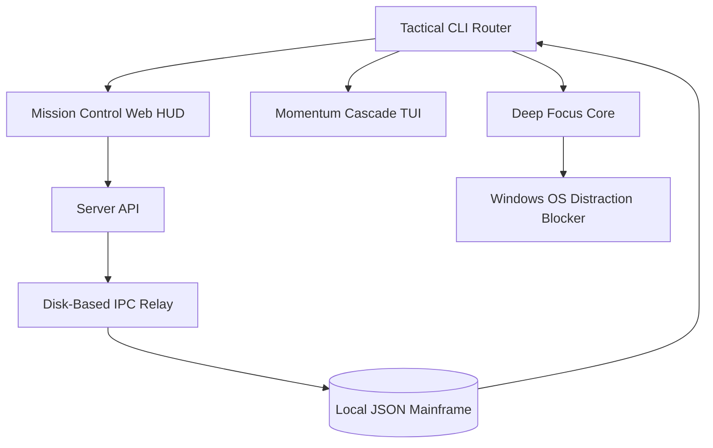

<div align="center">
  <h1>🌊 TaskFlow v6.0.0</h1>
  <p><strong>The Execution Engine — Engineered for Human Psychology</strong></p>
  <p><em>More than a task manager. A premium, high-fidelity productivity framework built to hack motivation, reduce cognitive friction, and force deep execution.</em></p>
  
  <p>
    
    
    
  </p>
</div>

---

## 🌟 The Product Vision: A Psychological Edge
TaskFlow was built as a premium startup-grade application to solve the fundamental flaw of modern to-do lists: **they cause anxiety instead of driving action.** 

Every pixel, terminal command, and background process in TaskFlow is engineered around human psychology. We don't just store tasks; we manipulate visual tension, eliminate choice paralysis, and trigger dopamine pathways to make high-output execution the path of least resistance. 

Version 6.0.0 introduces the **Mission Control Web HUD**, an elite, cinematic interface that translates your raw tasks into a visceral, glassmorphism-powered command center.

---

## 💎 The Execution Philosophy

TaskFlow acts as a **Tactical Command Center** that forces you to confront reality, commit to timeblocks, and execute relentlessly.

* **Eisenhower Matrix Native**: Priorities aren't numbers; they are weight-classed as `[CRITICAL]`, `[STRATEGIC]`, `[NOISE]`, and `[PURGE]`. 
* **The "One Frog" Protocol**: The `[★ PRIME TARGET]` mechanic mathematically limits you to *one* primary objective per day. No over-planning, just execution.
* **Temporal Pressure System**: As deadlines approach, the UI shifts. Soft deadlines rest in calm blue, while hard deadlines escalate visually—eventually pulsing with a red warning beam that leverages your subconscious urgency response.

---

## 🚀 The Three Phases of Execution

TaskFlow brings three robust "Execution Phases" that work in concert to protect your flow state:

### 🎯 Phase 1: Prioritization & The Live Dashboard
We prevent procrastination by hiding the noise and weaponizing urgency:
- **Dynamic Pressure Rendering**: Unscheduled missions exist calmly, but approaching deadlines trigger real-time CSS animations. A task missing its window isn't just "overdue"—it actively demands interception (Execute, Postpone, Drop, or Offload).
- **Recovery Mode Protocol**: When your day collapses under too many missed targets, the system detects it. The UI darkens, non-essential tasks blur out to 25% opacity, and a massive `RECOVERY MODE ACTIVE` gradient locks you into salvaging the day with 1-2 critical missions.

### 🛡️ Phase 2: The Soft Lock Focus Protocol
When you trigger a focus session, TaskFlow immerses you in a distraction-free environment that syncs your OS and your browser.
- **Visual Lockdown**: The Web HUD background instantly blurs via Glassmorphism, removing the cognitive load of *"what's next?"*.
- **Intentional Friction**: There is no "X" to close the focus window. You must click a translucent red `ABORT PROTOCOL` button and explicitly confirm a warning to break your focus.
- **System-Level Defense**: Focus sessions physically sever digital distractions by modifying the Windows `hosts` file and terminating unauthorized background apps.

### ⚡ Phase 3: Frictionless Capture
The greatest threat to deep work is the sudden interruption of a new idea. The Frictionless Capture system lets you dump thoughts instantly.
- **NLP Deadline Parsing**: Type `tomorrow 3pm` or `in 2 hours` and the engine natively maps it. No strict date formats; just pure, frictionless input.
- **The Web Omnibar**: Hit `Ctrl + K` from anywhere in the Web dashboard to instantly deploy the Capture Bar. Press `Enter` to inject the thought with zero page reloads.

---

## 🧠 The Dopamine & Momentum Engine

TaskFlow actively rewires behavioral persistence by making progress undeniably visible:
- **The Completion Horizon**: A live, animated progress bar measuring your integrity for the day. Watching the bar fill up provides an immediate, tangible dopamine reward.
- **Postpone Mirrors**: If you defer a task too many times, a stark `postponed ×3 ⚠` badge appears. The UI holds a mirror to your avoidance, prompting you to act or drop it.
- **Intelligent Next Targets**: Completing a mission triggers a curated, 3-task deployment modal based on priority, locking you into a continuous flow state.

---

## 🛠️ Tactical Command Guide

### 🧱 Core Orchestration
| Command | Action |
| :--- | :--- |
| `taskflow add` | Initiate an interactive mission entry sequence |
| `taskflow dump <text>`| Frictionless capture. Bypasses menus via NLP (e.g. `!h #tag`) |
| `taskflow list` | Query the mission board (`--todo`, `--priority`, `--tag`) |
| `taskflow view <id>`| Access a detailed mission brief and intel |
| `taskflow complete <id>`| Confirm mission `[V] SUCCESS` |
| `taskflow delete <id>` | Purge mission from the local database |

### ⚡ Execution & Strategy (Web + CLI Sync)
| Command | Action |
| :--- | :--- |
| `taskflow focus --id <id>` | Trigger Deep Work (Flags: `--minutes`, `--block-sites`, `--mode`) |
| `taskflow timeline` | Render a 7-day tactical strategy directly in stdout |
| `taskflow prime <id>` | Lock in your day's single `[★ PRIME TARGET]` |
| `taskflow schedule <id>`| Deploy a secondary mission to the timeline (YYYY-MM-DD) |
| `taskflow today` | Review today's Prime Target and secondary tactical assignments |
| `taskflow ui` | Deploy the **Mission Control** Web HUD |

### 🛰️ Intelligence & Ops
| Command | Action |
| :--- | :--- |
| `taskflow stats` | Deep analytical performance telemetry |
| `taskflow summary` | Human-readable executive mission overview |
| `taskflow blocklist`| Manage persistent website distraction targets |
| `taskflow backup` | Synchronize mission database with local backup |

---

## 🧬 Technical Architecture



---

## 🚀 Deployment & Installation

### Rapid Install
Clone and install the environment directly from GitHub:
```bash
pip install --upgrade git+https://github.com/Mohith535/TaskFlow.git
```

### Protocol Launch
```bash
# Register a new mission rapidly
taskflow dump "Configure AWS servers #devops !h"

# Start a 25-minute Strict Focus session on Task ID 1
taskflow focus --id 1 --minutes 25 --mode strict --block-sites youtube.com

# Launch the Web HUD
taskflow ui
```

---

## 🔒 Privacy & Sovereignty

> [!IMPORTANT]
> TaskFlow is a **100% Offline** system. 
> 
> ❌ **No Cloud Synchronization**  
> ❌ **No External Telemetry**  
> ❌ **No Background Surveillance**  
> 
> **Your productivity data is your own. It never leaves your machine.**

---

## 📄 License

**MIT License**
Copyright (c) 2026 **K Mohith Kannan**. 
*Built for those who demand clarity within the terminal.*
