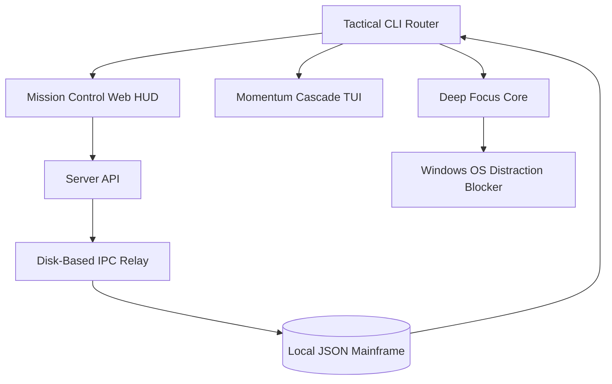

<div align="center">
  <h1>🌊 TaskFlow v6.0.0</h1>
  <p><strong>The Execution Engine</strong></p>
  <p><em>Momentum Engineering for Calm Productivity. A high-fidelity, privacy-first task ecosystem built for deep work.</em></p>
  
  <p>
    
    
    
  </p>
</div>

---

## 🌟 What's New in v6.0.0: The Professional Interface Upgrade
Version 6.0.0 marks the arrival of the ultimate, highly professional **Mission Control Web HUD**. We have entirely rebuilt the visual user interface to match the raw power of the backend execution engine. Expect deep glassmorphism aesthetics, real-time millisecond DOM injection, and a meticulously crafted premium environment that makes managing tasks a deeply satisfying and cinematic experience.

---

## 💎 The Execution Philosophy

TaskFlow is not a mere to-do list—it is a **Tactical Command Center** engineered to eliminate cognitive friction. Instead of forcing you to organize endless queues, it uses psychological frameworks to compel execution.

* **Eisenhower Matrix Native**: Priorities are visually weight-classed as `[CRITICAL]`, `[STRATEGIC]`, `[NOISE]`, and `[PURGE]`.
* **The "One Frog" Protocol**: The `[★ PRIME TARGET]` mechanic mathematically limits you to *one* primary objective per day. No over-planning, just execution.
* **Absolute Bi-Directional Sync**: Drag-and-drop on the Web HUD or type commands in the Terminal—your tactical timeline is instantly synchronized across both physical and visual spaces via disk-based IPC.

---

## 🚀 The Three Phases of Execution

TaskFlow v6.0.0 brings three robust "Execution Phases" that work in concert to protect your flow state:

### 🎯 Phase 1: Prioritization & Prime Targets
We prevent productivity procrastination by hiding the matrix and baking it into the visual identity of your tasks:
- **Progressive Reveal**: Unscheduled missions show bright red border beams for `[CRITICAL]` tasks, dropping down to dimmed text for `[PURGE]` tasks. You intuitively know what matters at a glance.
- **The Amber Dropzone**: The Weekly Timeline enforces the "Eat That Frog" philosophy by actively rejecting any attempt to schedule more than one `[★ PRIME TARGET]` per day.

### 🛡️ Phase 2: The Soft Lock Focus Protocol
When you trigger a focus session, TaskFlow immerses you in a distraction-free environment that syncs your OS and your browser.
- **Visual Lockdown**: The Web HUD background instantly blurs via Glassmorphism, removing the cognitive load of *"what's next?"*.
- **The Anchor Mechanism**: Your Prime Target is displayed dead-center beneath a massive 120px countdown timer.
- **Intentional Friction**: There is no "X" to close the focus window. You must click a translucent red `ABORT PROTOCOL` button and explicitly confirm a warning to break your focus.
- **System-Level Defense**: Focus sessions physically sever digital distractions by modifying the Windows `hosts` file and terminating unauthorized background apps.

### ⚡ Phase 3: Frictionless Capture
The greatest threat to deep work is the sudden interruption of a new idea. The Frictionless Capture system lets you dump thoughts instantly without breaking momentum.
- **The CLI Telemetry Protocol**: Bypass the interactive wizard entirely. Type `taskflow dump Buy new microphone` to instantly bank a thought into your `[inbox]`.
- **Inline NLP Parser**: The engine intercepts syntax natively. Typing `taskflow dump "Contact client #urgent !h"` silently categorizes the task as `[Critical]` and attaches the `#urgent` tag.
- **The Web Omnibar**: Hit `Ctrl + K` from anywhere in the Web dashboard to instantly deploy the Capture Bar. Press `Enter` to inject the thought via `POST /api/tasks/dump` with zero page reloads.

---

## 🧠 The Dopamine & Momentum Engine

TaskFlow actively rewires behavioral persistence by making progress undeniably visible:
- **Execution Efficiency Scores**: Completing a `[🔥 CRITICAL]` task triggers premium visual dopamine overlays (`+15% Execution Efficiency`).
- **Tactical Streaks**: The system monitors and displays consecutive days of completing the Prime Target, creating a psychological barrier to breaking the chain.
- **Intelligent Next Targets**: Instead of dumping you back into the main list, completing a mission immediately offers a curated, 3-task deployment modal based on priority and previous habits to lock you into a continuous flow state.

---

## 🛠️ Tactical Command Guide

### 🧱 Core Orchestration
| Command | Action |
| :--- | :--- |
| `taskflow add` | Initiate an interactive mission entry sequence |
| `taskflow dump <text>`| Frictionless capture. Bypasses menus via NLP (e.g. `!h #tag`) |
| `taskflow list` | Query the mission board (`--todo`, `--priority`, `--tag`) |
| `taskflow view <id>`| Access a detailed mission brief and intel |
| `taskflow complete <id>`| Confirm mission `[V] SUCCESS` |
| `taskflow delete <id>` | Purge mission from the local database |

### ⚡ Execution & Strategy (Web + CLI Sync)
| Command | Action |
| :--- | :--- |
| `taskflow focus --id <id>` | Trigger Deep Work (Flags: `--minutes`, `--block-sites`, `--mode`) |
| `taskflow timeline` | Render a 7-day tactical strategy directly in stdout |
| `taskflow prime <id>` | Lock in your day's single `[★ PRIME TARGET]` |
| `taskflow schedule <id>`| Deploy a secondary mission to the timeline (YYYY-MM-DD) |
| `taskflow today` | Review today's Prime Target and secondary tactical assignments |
| `taskflow ui` | Deploy the **Mission Control** Web HUD |

### 🛰️ Intelligence & Ops
| Command | Action |
| :--- | :--- |
| `taskflow stats` | Deep analytical performance telemetry |
| `taskflow summary` | Human-readable executive mission overview |
| `taskflow blocklist`| Manage persistent website distraction targets |
| `taskflow backup` | Synchronize mission database with local backup |

---

## 🧬 Technical Architecture



---

## 🚀 Deployment & Installation

### Rapid Install
Clone and install the environment directly from GitHub:
```bash
pip install --upgrade git+https://github.com/Mohith535/TaskFlow.git
```

### Protocol Launch
```bash
# Register a new mission rapidly
taskflow dump "Configure AWS servers #devops !h"

# Start a 25-minute Strict Focus session on Task ID 1
taskflow focus --id 1 --minutes 25 --mode strict --block-sites youtube.com

# Launch the Web HUD
taskflow ui
```

---

## 🔒 Privacy & Sovereignty

> [!IMPORTANT]
> TaskFlow is a **100% Offline** system. 
> 
> ❌ **No Cloud Synchronization**  
> ❌ **No External Telemetry**  
> ❌ **No Background Surveillance**  
> 
> **Your productivity data is your own. It never leaves your machine.**

---

## 📄 License

**MIT License**
Copyright (c) 2026 **K Mohith Kannan**. 
*Built for those who demand clarity within the terminal.*
