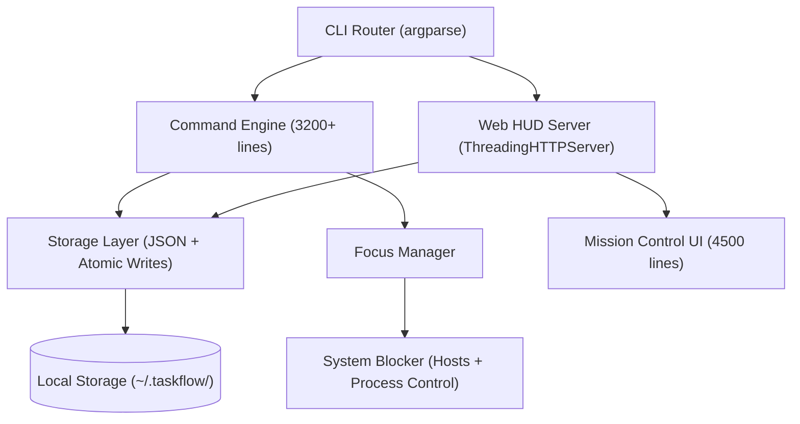

<div align="center">

# 🌊 TaskFlow v8.5.0

### The Execution Engine for Deep Work

<br/>

**A CLI-first productivity framework that uses behavioral psychology<br/>to turn your task list into an execution system.**

<br/>

<p>
  
  
  
  
</p>

<br/>

<div align="center">
  
  <br/>
  <sub>taskflow dump → taskflow today → taskflow ui</sub>
</div>

<br/>

<p>
  <a href="#-quick-start">Quick Start</a> · 
  <a href="#-what-makes-taskflow-different">Why TaskFlow</a> · 
  <a href="#-the-system">The System</a> · 
  <a href="#-command-reference">Commands</a> · 
  <a href="#-whats-built--whats-coming">Roadmap</a> · 
  <a href="docs/deep-dive.md">Psychology Deep-Dive →</a>
</p>

</div>

<br/>

---

<br/>

## ⚡ Quick Start

```bash
# Install
pip install --upgrade git+https://github.com/Mohith535/TaskFlow.git

# Verify installation
taskflow doctor
```

```bash
# First run — guided setup wizard
taskflow
```

```bash
# Capture anything instantly (NLP extracts everything)
taskflow dump "Finish project report by Friday #work !h"

# Add a task with full context
taskflow add
# → guided prompts: title, priority, tags,
#   notes, links, duration, deadline

# See what to do RIGHT NOW
taskflow today

# Enter deep focus
taskflow focus --id 1 --minutes 45 --mode strict

# Launch the visual dashboard
taskflow ui
```

```bash
# When the day gets rough
taskflow recover
```

> **💡 If `taskflow` isn't recognized**, use `python -m taskflow` as a drop-in replacement:
> ```bash
> python -m taskflow list
> python -m taskflow ui
> ```

<br/>

---

<br/>

## 🧠 What Makes TaskFlow Different

Most task managers are **passive lists** — they store what you type and wait. TaskFlow is an **active execution system** that uses proven psychology to structure how you commit, focus, and finish.

<table>
<tr>
<td width="25%">

### 🐸 The One Frog Protocol
One `[★ PRIME TARGET]` per day. Not two. Not five. One.<br/><br/>
Based on Mark Twain's "Eat the Frog" principle and research on willpower depletion — your strongest cognitive resources exist in the first hours of your day. TaskFlow forces you to choose the one thing that matters most.

</td>
<td width="25%">

### 🔥 Priority as Psychology
No "1-5" scales. Priorities are **behavioral categories**:<br/><br/>
`[🔥 CRITICAL]` — Do now<br/>
`[📅 STRATEGIC]` — The 20% that drives 80% of results<br/>
`[⚡ NOISE]` — Delegate or bypass<br/>
`[❌ PURGE]` — System suggests removal<br/><br/>
Mapped to the Eisenhower Matrix. Forces real triage.

</td>
<td width="25%">

### 🛡️ Focus Protocol
Launch a focus session and TaskFlow builds a **multi-layered defense** around your attention:<br/><br/>
**Visual** — Dashboard blurs. Only your task exists.<br/>
**Friction** — No "X" button. Quitting requires explicit confirmation.<br/>
**System** — Optional strict mode blocks websites at the OS level.

</td>
<td width="25%">

### ⏱️ Temporal Pressure
Deadlines aren't just dates — they're **visual states**:<br/><br/>
🔵 Calm blue → comfortable timeline<br/>
🟡 Amber pulse → approaching deadline<br/>
🔴 Red warning → demands action now<br/><br/>
Missed a deadline? You must explicitly Execute, Postpone, Drop, or Offload. No silent failures.

</td>
</tr>
<tr>
<td width="25%">

### 📥 2-Second Capture
The `dump` command captures thoughts faster than any app:<br/><br/>
```bash
taskflow dump "Call dentist #personal !h"
```
NLP extracts priority, tags, and deadlines automatically. Based on the Zeigarnik Effect — unwritten thoughts leak cognitive bandwidth.

</td>
<td width="25%">

### 📈 Momentum Engine
Progress isn't just tracked — it's **felt**:<br/><br/>
• Live completion progress bar<br/>
• Premium completion animations<br/>
• Postpone mirrors (`postponed ×3 ⚠`) that hold you accountable<br/>
• Intelligent next-target suggestions after each completion

</td>
<td width="25%">

### ▶ Today View — The Now Window
One command answers the question "what should I do RIGHT NOW?" with a single answer:<br/><br/>
`taskflow today` renders your day as a mission briefing — chronological, with a 90-minute rolling Now Window that shows exactly which task you should be executing at this moment. Not a list. A directive.

</td>
<td width="25%">

### 🔔 Intelligent Reminders
Reminders are calculated from priority + duration + deadline type — not a fixed 1-hour default.<br/><br/>
A HIGH+HARD task gets a 2-hour warning AND a 30-min second reminder. A LOW+SOFT task gets a 15-minute nudge. The system models a thoughtful colleague, not an alarm clock.

</td>
</tr>
<tr>
<td width="25%">

### ⚖️ Forced Confrontation
Silent "overdue" labels enable avoidance. TaskFlow forces a decision on every missed task:<br/><br/>
**[E]** Execute now · **[P]** Postpone · **[D]** Drop · **[O]** Offload<br/><br/>
The fourth option — Offload — explicitly names "this is no longer my responsibility," converting passive neglect into conscious release.

</td>
<td width="25%">

### ⚡ Recovery Mode
When too many deadlines collapse, TaskFlow detects the overload and offers recovery — automatically at 6pm, or manually anytime:<br/><br/>
- UI darkens. Non-essential tasks blur to 25%.<br/>
- Only 1-2 critical missions remain visible.<br/>
- "Salvage my day" — not "you failed."<br/><br/>
Four entry points in the Web HUD. Always opt-in.

</td>
<td width="25%">

### 📝 Task Enrichment
Every mission can carry full context:<br/><br/>
- **Notes** — free-text description with multi-line support<br/>
- **Links & References** — URLs, map locations, documents, files (auto-detected type)<br/>
- **Checklist** — sub-tasks with progress tracking<br/><br/>
All accessible inline in the CLI and expandable on Web HUD cards. Zero separate apps needed.

</td>
<td width="25%">

### ⏳ Duration Intelligence
Estimate time on every task. Track actuals. Build your personal accuracy profile:<br/><br/>
```bash
Duration: 1h  →  Actual: 1h 34m
Accuracy ratio: 1.57 (you underestimate by ~57%)
```
The foundation of the Phase 2 AI estimation layer — your own history becomes your forecasting instrument.

</td>
</tr>
</table>

<br/>

> **📖 Want the full psychology breakdown?** Every feature is backed by published research — from Csíkszentmihályi's Flow State to Cialdini's Commitment Principle.
> 
> **[Read the Deep-Dive →](docs/deep-dive.md)**

<br/>

---

<br/>

## ⚙️ The System

### Dual-Mode Reality Engine

TaskFlow splits all work into two temporal modes:

| Mode | Behavior | Example |
|:---|:---|:---|
| **📋 Task** | Flexible. Can be scheduled, postponed, re-prioritized | "Finish the API refactor this week" |
| **📅 Event** | Fixed. Time-locked, duration auto-calculated, immutable | "Team standup at 9:00 AM" |

This mirrors how reality actually works — some things bend, some don't. Mixing them in one flat list creates cognitive noise.

### Recovery Mode

When too many deadlines collapse in a single day, TaskFlow detects the overload and triggers **Recovery Mode**:

- Non-essential tasks blur to 25% opacity
- A `RECOVERY MODE ACTIVE` banner locks the interface
- Only 1-2 critical missions remain visible
- Forces triage instead of panic

### Today View — Mission Briefing, Not Task List

`taskflow today` renders your day as a chronological execution plan with a **90-minute Now Window**:

```
── TODAY · Thursday, 25 Apr ──────────────────────
✓  09:00  Write API docs            [done]
▶  11:00  Review PR for backend     [NOW ← you are here]
          High · #work · 1h · ends ~12:00
   14:00  Team standup
   16:00  Deploy to staging         ⚠ HARD · 4h left
──────────────────────────────────────────────────
Next mission: Review PR (started 11 min ago)
```

One marker. One task. No decision required.

### Execution Pressure System

As deadlines approach, TaskFlow quietly shifts its visual tone — no alarms, no popups, just color:

| Time Remaining | Signal |
|:---|:---|
| 3h+ | Normal |
| 1h–3h | Amber border appears |
| 15min–1h | Title turns amber |
| < 15min | Title turns red, border pulses |

The pressure is felt before it is consciously noticed — designed to create urgency without anxiety, operating exactly at the optimal point of the Yerkes-Dodson arousal curve.

### Mission Control — Web HUD

Run `taskflow ui` to launch a local web dashboard with:

- Real-time task board with drag-and-drop scheduling
- Visual timeline with hour-block selection
- Focus session overlay with glassmorphism lockdown
- Priority-based color coding and pressure animations
- Full keyboard shortcut support

**100% offline. No accounts. No cloud. Runs on `localhost`.**

<br/>

---

<br/>

## 📟 Command Reference

### Core Operations

| Command | What It Does |
|:---|:---|
| `taskflow add` | Interactive mission creation with guided prompts |
| `taskflow dump <text>` | Instant capture with NLP — `"task #tag !h"` for priority + tags |
| `taskflow list` | Mission board view — filter with `--todo`, `--done`, `--priority`, `--tag` |
| `taskflow view <id>` | Full mission brief with history and metadata |
| `taskflow edit <id>` | Modify mission parameters |
| `taskflow complete <id>` | Mark as done ✓ |
| `taskflow undo <id>` | Re-open a completed mission |
| `taskflow delete <id>` | Remove from database |
| `taskflow note <id>` | Add or edit notes on a mission |
| `taskflow link <id>` | Manage links and references on a mission |
| `taskflow check <id>` | Manage checklist items on a mission |

### Execution & Focus

| Command | What It Does |
|:---|:---|
| `taskflow focus --id <id>` | Start a focus session (flags: `--minutes`, `--mode`, `--block-sites`) |
| `taskflow prime <id>` | Set today's single Prime Target |
| `taskflow schedule <id> <date>` | Assign mission to timeline |
| `taskflow today` | Review today's Prime Target and assignments |
| `taskflow timeline` | Render 7-day tactical view in terminal |
| `taskflow missed` | Address missed missions interactively (Execute / Postpone / Drop / Offload) |
| `taskflow missed --skip` | List all missed missions without prompts |
| `taskflow postpone <id>` | Proactively reschedule any mission |
| `taskflow recover` | Enter Recovery Mode manually |
| `taskflow recover --status` | Check Recovery Mode status |
| `taskflow ui` | Launch the Mission Control web dashboard |

### Intelligence & Maintenance

| Command | What It Does |
|:---|:---|
| `taskflow stats` | Performance analytics |
| `taskflow summary` | Human-readable overview |
| `taskflow search <keyword>` | Query mission database |
| `taskflow tag <id> <tags>` | Categorize missions |
| `taskflow note <id>` | Append notes to a mission |
| `taskflow remind <id>` | View or set reminder times for a mission |
| `taskflow doctor` | Full system health check — Python, dependencies, PATH, tasks |
| `taskflow backup` | Manual backup to `~/.taskflow/backups/` |
| `taskflow version` | System info — Python version, data path, mission count |

<br/>

---

<br/>

## 🗺️ What's Built & What's Coming

### ✅ Phase 1 — Complete (v8.0.0)
The full behavioral execution engine — no AI required.

- Duration estimation and accuracy tracking
- Natural language deadline parsing
- Soft/Hard deadline taxonomy
- Execution pressure system (live color shifts)
- Today View with 90-minute Now Window
- Missed task forced confrontation
- Postpone counter mirror
- Smart context-matched reminder engine
- Recovery Mode (auto + manual)
- Task enrichment (notes, links, checklist)

### 🔄 Phase 2 — In Progress
History-driven behavioral intelligence.

- Daily Execution Path (energy-curve scheduling)
- Time Integrity Score (planned vs actual drift)
- Focus Window Lock (queue-not-block during sessions)
- Weekly behavioral review

### 🔮 Phase 3 — After LLM Integration
AI that knows how you actually work.

- Smart duration estimation from your history
- Auto rescheduling intelligence
- Natural language goal → task breakdown
- Proactive daily brief
- Intelligent Recovery Mode (context-aware triage)

> The AI layer builds on the behavioral data Phase 1 collects silently. The longer you use TaskFlow, the smarter Phase 3 becomes.

<br/>

---

<br/>

## 🏗️ Architecture



**Design principles:**
- **Local-first** — All data in `~/.taskflow/`. Zero cloud. Zero telemetry.
- **Atomic writes** — Saves to `.tmp` then replaces. No corruption on crash.
- **Auto-backup** — Last 10 states preserved. One-command restore.
- **CLI-first** — Every feature works from terminal. Web HUD is a visual accelerator.

<br/>

---

<br/>

## 🚀 Installation

### Prerequisites
- **Python 3.8+** — [python.org](https://www.python.org/downloads/) — ⚠️ tick **"Add Python to PATH"** during install
- **Git** — [git-scm.com](https://git-scm.com/download/win) *(or use Method 2 below for no-Git install)*

### Method 1 — From GitHub *(recommended)*
```bash
pip install --upgrade git+https://github.com/Mohith535/TaskFlow.git
```

### Method 2 — From ZIP *(no Git required)*
1. [Download the ZIP](https://github.com/Mohith535/TaskFlow/archive/refs/heads/main.zip)
2. Extract it
3. Open a terminal in the extracted folder:
```bash
pip install .
```

### Method 3 — Development
```bash
git clone https://github.com/Mohith535/TaskFlow.git
cd TaskFlow
pip install -e .
```

### Verify
```bash
taskflow version
```

<br/>

---

<br/>

## 🔧 Troubleshooting

<details>
<summary><b>⚠️ <code>pip</code> is not recognized</b></summary>
<br/>

Python's `pip` isn't in your PATH. Use this instead:
```bash
python -m pip install --upgrade git+https://github.com/Mohith535/TaskFlow.git
```
If that also fails:
```bash
python -m ensurepip --upgrade
```
</details>

<details>
<summary><b>⚠️ <code>git</code> is not recognized</b></summary>
<br/>

Either install Git from [git-scm.com](https://git-scm.com/download/win) and restart your terminal, or use **Method 2** (ZIP install) — no Git required.
</details>

<details>
<summary><b>⚠️ <code>taskflow</code> not recognized after install</b></summary>
<br/>

Python's `Scripts` folder isn't in your PATH. Two options:

**Option A** — Use the module runner (works immediately):
```bash
python -m taskflow list
python -m taskflow ui
```

**Option B** — Add Scripts to PATH:
1. Find the path from pip's install warning (e.g. `C:\Users\YourName\...\Scripts`)
2. Search Windows for **"Environment Variables"**
3. Edit **Path** → Add the Scripts folder
4. Restart your terminal
</details>

<details>
<summary><b>⚠️ <code>python -m taskflow</code> module error</b></summary>
<br/>

Update to the latest version:
```bash
pip install --upgrade git+https://github.com/Mohith535/TaskFlow.git
```
</details>

<br/>

---

<br/>

## 🎨 Community Themes

TaskFlow's Web HUD is open for community customization. The UI layer is built with a clean theme system — CSS variables control all colors, spacing, and fonts.

**Want to build a theme?**
1. Fork the repository
2. Modify the CSS variables in the `:root` block of `task_manager/web_ui.py` (every color, font, and width token lives there)
3. Submit a PR with a screenshot
4. The best theme each month gets featured here

*The theme gallery is coming soon.*

<br/>

---

<br/>

## 🔒 Privacy

> TaskFlow is **100% offline**. Your data lives in `~/.taskflow/` on your machine.
> 
> ❌ No cloud sync · ❌ No telemetry · ❌ No accounts · ❌ No tracking
> 
> **Your productivity data never leaves your machine.**

<br/>

---

<br/>

## 📖 Documentation

| Document | Description |
|:---|:---|
| **[Psychology Deep-Dive](docs/deep-dive.md)** | The research behind every feature — Eisenhower Matrix, Zeigarnik Effect, Flow State, and 15+ other frameworks |
| **[README](README.md)** | You're reading it |

<br/>

---

<br/>

<div align="center">

**MIT License** · Copyright © 2026 [K Mohith Kannan](https://github.com/Mohith535)

*Built for those who ship.*

</div>
