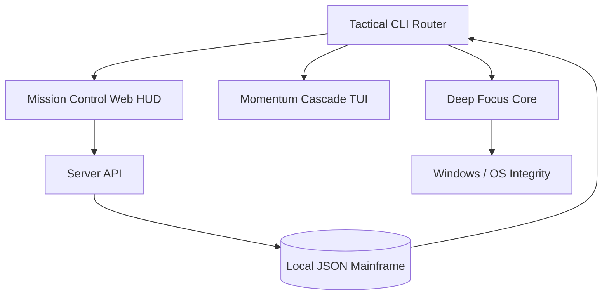

# 🌊 TaskFlow v3.5.0 "Momentum"
> **Momentum Engineering for Calm Productivity. A high-fidelity, privacy-first task ecosystem built for deep work.**

---

## 💎 The TaskFlow Philosophy
TaskFlow is not just a task manager; it is a **Tactical Command Center** for your cognitive load. Designed with a "Premium Emerald" aesthetic and built on a foundation of "Momentum Engineering," it provides a supportive, high-performance environment for effortless mastery.

---

## ✨ Primary Interfaces

### 🌌 Momentum Cascade (The TUI)
A revolutionary Terminal User Interface built with **Textual**. It prioritizes "Psychological Reinforcement" through reactive animations and mechanical precision.
- **Magnetic Selection**: Interactive mission rows with high-fidelity "lifting" and "glowing" effects.
- **Domino Rendering**: A structured, sequential task cascade that reduces initial visual overwhelm.
- **Success Ripples**: Visually satisfying green-wave animations upon mission completion.
- **Effortless Navigation**: Optimized for keyboard-only interaction with zero-latency response.

### 🛰️ Mission Control (The Web HUD)
A state-of-the-art **Three.js** powered web dashboard for the modern developer.
- **Glassmorphism Architecture**: A sleek, translucent UI over a procedural ambient space-grid.
- **Real-Time Telemetry**: Live synchronization of task states and focus progress with millisecond precision.
- **Tactical HUD**: Integrated focus monitoring with holographic scanlines and automated protocol transitions.
- **Multi-View System**: Dynamic timeline and mission board views with integrated drag-and-drop orchestration.

---

## 🎯 The Deep Focus Engine

TaskFlow features a multi-layered distraction defense system designed to protect your flow state.

### 🛡️ Focus Protocols
- **Strict Mode (System-Level)**: Force-severs digital distractions by modifying the Windows `hosts` file and terminating unauthorized background processes.
- **Gentle Mode (Mindful)**: Provides calm, non-interruptive reminders to maintain alignment with your current mission.
- **Persistence Engine**: A detached background worker silently tracks your session and restores system integrity automatically when the timer expires.

### 🧘 Mindful Bypass Protection
- **Anti-Impulse Logic**: Prevents accidental or impulsive session breaks by requiring intentional confirmation before early unblocking.
- **Self-Healing Index**: Automatically detects and repairs orphaned system-level blocks on startup from previous system crashes.

---

## 🛠️ Tactical Command Guide

### 🧱 Core Orchestration
| Command | Description |
| :--- | :--- |
| `taskflow add` | Initiate an interactive mission entry sequence |
| `taskflow list` | Query the mission board (`--todo`, `--priority`, `--tag`) |
| `taskflow view <id>`| Access a detailed mission brief and intel |
| `taskflow complete <id>`| Confirm mission [V] SUCCESS |
| `taskflow delete <id>` | Purge mission from the local database |

### ⏳ Chrono & Focus
| Command | Description |
| :--- | :--- |
| `taskflow focus` | Activate Focus Flow (`--id`, `--minutes`, `--mode`) |
| `taskflow schedule` | Assign mission to the timeline (`today`, `tomorrow`, `YYYY-MM-DD`) |
| `taskflow ui` | Deploy the **Mission Control** Web HUD |
| `taskflow ui --tui` | (Coming Soon) Launch the **Momentum Cascade** standalone |

### 🧠 Intelligence & Ops
| Command | Description |
| :--- | :--- |
| `taskflow stats` | Deep analytical performance telemetry |
| `taskflow summary` | Human-readable executive mission overview |
| `taskflow blocklist`| Manage persistent website distraction targets |
| `taskflow focus-blocking`| Check current system-level blocking status |
| `taskflow test-blocking`| Validate blocking system integrity (--mode) |
| `taskflow backup` | Synchronize mission database with local backup |

---

## 🧬 Technical Architecture



---

## 🚀 Deployment & Installation

### Rapid Install
Clone and install the environment directly from GitHub:
```bash
pip install --upgrade git+https://github.com/Mohith535/TaskFlow.git
```

### Protocol Launch
```bash
# Register a new mission
taskflow add

# Start a 25-minute Strict Focus session
taskflow focus --id 1 --minutes 25 --mode strict

# Launch the Web HUD
taskflow ui
```

---

## 🔒 Privacy & Sovereignty
TaskFlow is a **100% Offline** system. 
- ❌ **No Cloud Synchronization**
- ❌ **No External Telemetry**
- ❌ **No Background Surveillance**

**Your productivity data is your own. It never leaves your machine.**

---

## 📄 MIT License
Copyright (c) 2026 **K Mohith Kannan**. 
Built for those who demand clarity within the terminal.
