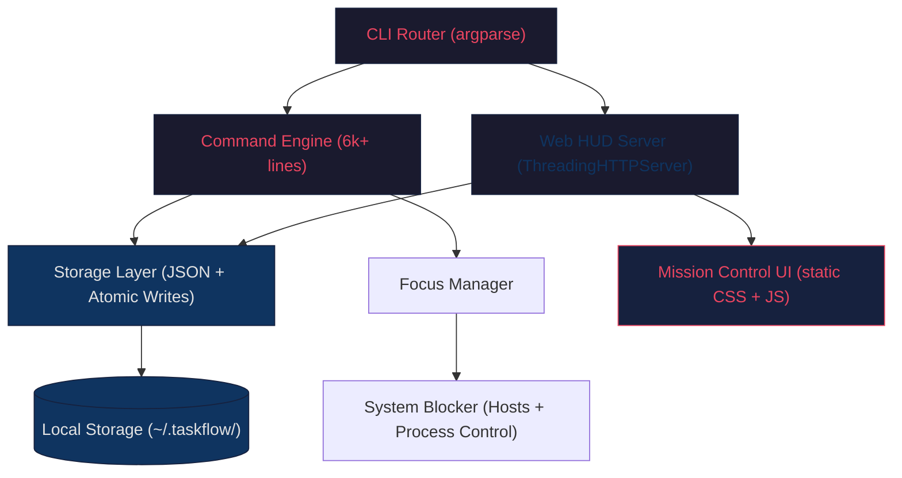

# 🧠 TaskFlow — The Psychology & Design Deep-Dive

<div align="center">
  <em>"The best productivity system is the one that works with your brain, not against it."</em>
</div>

---

> **This document is a companion to the [README](../README.md).** While the README shows you *what* TaskFlow does, this document explains *why* every feature exists — rooted in behavioral psychology, cognitive science, and battle-tested productivity frameworks used by elite performers.

---

## Table of Contents

- [The Core Problem](#-the-core-problem)
- [1. The Matrix — Eisenhower Prioritization](#-1-the-matrix--eisenhower-prioritization)
- [2. The One Frog Protocol — Parkinson's Law](#-2-the-one-frog-protocol--parkinsons-law)
- [3. Duration Estimation — Defeating the Planning Fallacy](#-3-duration-estimation--defeating-the-planning-fallacy)
- [4. Natural Language Deadlines — Friction is the Enemy of Commitment](#-4-natural-language-deadlines--friction-is-the-enemy-of-commitment)
- [5. Deadline Taxonomy — Why Treating All Deadlines the Same is a Design Failure](#-5-deadline-taxonomy--why-treating-all-deadlines-the-same-is-a-design-failure)
- [6. Temporal Pressure — Urgency & The Deadline Effect](#-6-temporal-pressure--urgency--the-deadline-effect)
- [7. Calibrated Urgency — The Yerkes-Dodson Law Applied to UI Design](#-7-calibrated-urgency--the-yerkes-dodson-law-applied-to-ui-design)
- [8. The Now Window — Eliminating the Most Expensive Question in Productivity](#-8-the-now-window--eliminating-the-most-expensive-question-in-productivity)
- [9. Forced Confrontation — Why Silent "Overdue" Labels Are a Design Failure](#-9-forced-confrontation--why-silent-overdue-labels-are-a-design-failure)
- [10. The Postpone Mirror — Accountability Without Judgment](#-10-the-postpone-mirror--accountability-without-judgment)
- [11. The Signal Problem — Why Fixed Reminders Train You to Ignore Everything](#-11-the-signal-problem--why-fixed-reminders-train-you-to-ignore-everything)
- [12. Focus Protocol — Flow State Engineering](#-12-focus-protocol--flow-state-engineering)
- [13. Frictionless Capture — The Zeigarnik Effect](#-13-frictionless-capture--the-zeigarnik-effect)
- [14. Dopamine & Momentum — Behavioral Persistence](#-14-dopamine--momentum--behavioral-persistence)
- [15. Recovery Mode — Cognitive Overload Defense](#-15-recovery-mode--cognitive-overload-defense)
- [16. Dual-Mode Reality Engine — Temporal Structuring](#-16-dual-mode-reality-engine--temporal-structuring)
- [17. The Deadline Change — Cognitive Dissonance & the Self-Justification Trap](#-17-the-deadline-change--cognitive-dissonance--the-self-justification-trap)
- [18. The Evening Problem — Why TaskFlow Changes Behavior After 6pm](#-18-the-evening-problem--why-taskflow-changes-behavior-after-6pm)
- [19. The Edit History — Behavioral Data as a Mirror](#-19-the-edit-history--behavioral-data-as-a-mirror)
- [Technical Architecture](#-technical-architecture)
- [References](#-references)

---

## 🎯 The Core Problem

Most productivity tools fail because they act as **passive databases** — digital dumping grounds for "things to do." This creates a paradox:

> *The more tasks you add, the more overwhelmed you feel. The more overwhelmed you feel, the less you execute. The less you execute, the more tasks pile up.*

This is the **Productivity Anxiety Loop**, and it's rooted in well-documented psychology:

- **Choice Paralysis** (Schwartz, 2004) — When presented with too many options, people freeze. A list of 47 tasks doesn't motivate; it paralyzes.
- **Cognitive Load Theory** (Sweller, 1988) — Working memory can hold ~4 items. Every unprocessed task in your list consumes cognitive bandwidth, even when you're not looking at it.
- **The Planning Fallacy** (Kahneman & Tversky, 1979) — People systematically underestimate task duration, leading to chronic over-planning and under-execution.

**TaskFlow's approach:** Instead of being a passive list, TaskFlow is an **Execution Engine** — it actively structures, constrains, and pressures your workflow to align with how your brain actually processes commitment and action.

---

## 🔥 1. The Matrix — Eisenhower Prioritization

### The Psychology

The human brain is naturally poor at differentiating between **Urgent** (requires immediate attention) and **Important** (contributes to long-term goals). When overwhelmed, the brain defaults to reacting to the Urgent while ignoring the Important. This is the **Mere Urgency Effect** (Zhu, Yang, & Hsee, 2018).

Additionally, the **Pareto Principle (80/20 Rule)** shows that roughly 80% of meaningful outcomes come from just 20% of your tasks. Most people spend their energy on the wrong 80%.

### Historical Precedent

**President Dwight D. Eisenhower** — Managing the Allied Forces in WWII and later the U.S. Presidency, Eisenhower organized his entire decision-making by separating the "Urgent" from the "Important":

> *"What is important is seldom urgent, and what is urgent is seldom important."*

### How TaskFlow Implements This

TaskFlow doesn't use numeric priorities (1-5). Instead, it uses **weight-class categorization** that maps directly to the Eisenhower Matrix:

| Priority | Matrix Zone | Behavioral Intent |
|:---|:---|:---|
| `[🔥 CRITICAL]` | Urgent + Important | **Do immediately.** No delay. |
| `[📅 STRATEGIC]` | Important + Not Urgent | The 20% that drives 80% of results. Must be scheduled. |
| `[⚡ NOISE]` | Urgent + Not Important | Delegate, automate, or bypass. |
| `[❌ PURGE]` | Not Urgent + Not Important | System actively suggests removal. |

By forcing categorization into behavioral zones rather than arbitrary numbers, TaskFlow eliminates the ambiguity that causes **priority inflation** — where everything becomes "high priority" and nothing gets done.

---

## 🐸 2. The One Frog Protocol — Parkinson's Law

### The Psychology

**Parkinson's Law** states: *"Work expands to fill the time allotted for its completion."* Give yourself "all day" to write a report, and it will take all day. Constrain yourself to 90 minutes, and you'll finish in 90 minutes.

Furthermore, research on **willpower depletion** (Baumeister & Tierney, 2011) shows that decision-making quality degrades throughout the day. Your strongest cognitive resources exist in the first 2-4 hours of your morning.

**Mark Twain** captured this perfectly:

> *"Eat a live frog first thing in the morning, and nothing worse will happen to you the rest of the day."*

### Historical Precedent

- **Elon Musk & Bill Gates** — Both are famous for strict "Time Boxing." Musk reportedly schedules his day in 5-minute increments. Every block is assigned a specific objective, eliminating the mental friction of choosing what to do next.
- **Cal Newport's Deep Work** — Newport argues that elite output requires eliminating choice from your morning routine. You don't "decide" what to work on; you commit to it the night before.

### How TaskFlow Implements This

The `[★ PRIME TARGET]` mechanic enforces **mathematical singularity**: exactly **one** primary objective per day. No exceptions.

```bash
taskflow prime 12          # Lock task #12 as today's Prime Target
taskflow today             # See your commitment
```

The system:
- Only allows **one** Prime Target per day
- Displays it with prominent visual hierarchy in both CLI and Web HUD
- Creates psychological commitment — once you "prime" a task, breaking that contract becomes psychologically costly (the **Commitment & Consistency Principle**, Cialdini, 1984)

Secondary tasks exist as supporting missions, but the Prime Target is your non-negotiable "frog."

---

## ⏳ 3. Duration Estimation — Defeating the Planning Fallacy

### The Psychology

The **Planning Fallacy** (Kahneman & Tversky, 1979) is one of the most replicated findings in behavioral economics: humans systematically underestimate how long tasks take — by **25–50% on average**. This is not carelessness; it is a fundamental feature of how the brain projects the future. We imagine the *ideal* scenario, not the realistic one. We recall our *intentions*, not our actual history.

The cost of this bias is concrete: over-planned days, chronic under-execution, and a growing backlog that feeds the **Productivity Anxiety Loop** described in [The Core Problem](#-the-core-problem).

The act of estimating duration — *even imperfectly* — forces the brain to make a **cognitive commitment**. People who write down a time estimate complete tasks at a measurably higher rate than those who don't. Not because the estimate is accurate, but because the act of estimating creates a psychological contract with the future self. It activates what Gollwitzer (1999) calls an **implementation intention** — a mental link between a situation ("when I start this task") and a response ("I will spend 1 hour on it").

A second mechanism is at work: **visible duration creates honest confrontation.** When a task that has lingered on your list for a week shows `[2h]` next to it, the brain can no longer pretend it is a 5-minute job. Avoidance thrives on ambiguity. Duration destroys it.

> *"It always takes longer than you expect, even when you take into account Hofstadter's Law."* — Hofstadter's Law

### Historical Precedent

Elite project managers use **reference class forecasting** (Flyvbjerg, 2006) — instead of asking "how long will *this* take?" they ask "how long did *similar* tasks take in the past?" TaskFlow's duration-accuracy tracking (actual vs. estimated) builds this personal reference class automatically over time, turning your own history into a forecasting instrument.

### How TaskFlow Implements This

- A **duration field** on every task: `15m` / `30m` / `1h` / `2h` / `3h` / `4h+`
- **Actual time** captured when a focus session starts and when the task completes
- A `duration_accuracy_ratio` (actual ÷ estimated) stored per task
- Over time, a **personal accuracy profile** emerges — your own calibration curve

```bash
taskflow add
Task title: Write API documentation
Duration (15m/30m/1h/2h/3h/4h+) [skip]: 2h
→ Task #9 added. Est. 2h.
```

The estimate is shown everywhere the task appears — in `taskflow list`, `taskflow today`, and on the Web HUD cards — so the cost of the work is never hidden from the person deciding whether to start it.

> **See also:** the `duration_accuracy_ratio` is the raw material for the Phase 2 AI estimation layer, which will quietly auto-correct your estimates using your own reference class.

---

## 💬 4. Natural Language Deadlines — Friction is the Enemy of Commitment

### The Psychology

**BJ Fogg's Behavior Model** (2009) identifies three components required for *any* behavior to occur: **Motivation, Ability, and a Prompt** (B = MAP). When Ability drops — i.e., the action becomes harder — even high-Motivation people fail to act.

Asking a user to type `2026-04-25 15:00` to set a deadline is a friction point that taxes working memory, interrupts flow, and — most critically — creates a pause long enough for the brain to rationalize skipping it. *"I'll set the deadline later"* is how tasks become perpetually undated. **Undated tasks are almost never done.**

The **2-Second Rule** (a heuristic used in GTD and grounded in Fogg's research) states: if a behavior requires more than ~2 seconds of friction, completion rate drops dramatically. Natural-language parsing collapses the deadline-setting action to the same cognitive cost as a normal sentence. The user says what they mean; the system handles the rest.

Confirmation of the parsed result serves a second purpose: it creates a moment of **conscious acknowledgment**. The user sees the deadline as a real, concrete thing — not an abstract form field — which strengthens commitment (Cialdini's **Commitment & Consistency Principle**, 1984; see also [Section 2](#-2-the-one-frog-protocol--parkinsons-law)).

### How TaskFlow Implements This

```bash
Deadline: tomorrow 3pm
→ Parsed: Thursday, 25 Apr 2026 at 15:00
  Confirm? [Y/n]: Y
```

Supported patterns include `tomorrow 3pm`, `Friday`, `in 2 hours`, `next Monday`, `April 30`, and bare time-of-day words like `morning` and `evening`. The same parser powers frictionless capture (see [Section 13](#-13-frictionless-capture--the-zeigarnik-effect)), so a deadline can be set in the same breath as the thought:

```bash
taskflow dump "Deploy server tomorrow 3pm #work !h"
```

If the phrase can't be understood, the system re-prompts once with an example rather than silently failing — preserving the user's momentum instead of dumping them into a date-format manual.

---

## 🚦 5. Deadline Taxonomy — Why Treating All Deadlines the Same is a Design Failure

### The Psychology

**Signal detection theory** (Green & Swets, 1966) explains a phenomenon every overwhelmed professional knows intuitively: *when everything is urgent, nothing is.* This is the **signal-to-noise collapse**. Systems that treat a flexible personal deadline ("finish the article this week") identically to a hard external commitment ("client presentation at 2pm Friday") train users to ignore all deadline indicators equally — the *boy who cried wolf* effect, where every warning gets tuned out.

The neurological basis is **habituation**: repeated identical stimuli produce a decreasing neural response. The same red `OVERDUE` badge on a trivial task and a critical one causes the brain to stop responding to *either*. Differentiation restores the salience of genuine urgency.

There is also a profound difference in *how* people experience the two kinds of deadline:

- **Soft deadlines** create **optimization pressure** — *"I should try to do this by then."*
- **Hard deadlines** create **loss-aversion pressure** — *"if I miss this, something bad happens."*

Both are motivating, but through completely different mechanisms. Conflating them destroys both signals at once.

### How TaskFlow Implements This

Every deadline is typed at creation, and the type propagates through every surface:

| Type | CLI Display | UI Signal | System Response |
|:---|:---|:---|:---|
| **Soft** | `[soft]` (clean — default) | Calm blue | Gentle `ℹ` notice |
| **Hard** | `[HARD]` in red | Pulsing red | `⚠` Block alert |

```bash
taskflow add --deadline "Friday 3pm" --hard
→ [HARD] Client presentation — Fri 25 Apr at 15:00
   ⚠ Hard deadline. System will alert if missed.
```

Soft is the silent default — a clean, low-noise state. The `[HARD]` tag is the only one rendered loudly, which is precisely what keeps it meaningful. This taxonomy is the foundation the entire [Execution Pressure System](#-7-calibrated-urgency--the-yerkes-dodson-law-applied-to-ui-design) and [Smart Reminder Engine](#-11-the-signal-problem--why-fixed-reminders-train-you-to-ignore-everything) build upon.

---

## ⏱️ 6. Temporal Pressure — Urgency & The Deadline Effect

### The Psychology

**The Deadline Effect** is one of the most powerful productivity forces: tasks with clear deadlines are 2-3x more likely to be completed than open-ended ones. This is because:

- **Loss Aversion** (Kahneman & Tversky, 1979) — People fear losing progress more than they desire making progress. An approaching deadline triggers loss aversion.
- **The Arousal Theory of Motivation** — Moderate stress (eustress) improves performance. Too little → boredom. Too much → anxiety. A visible, approaching deadline creates optimal arousal.

### How TaskFlow Implements This

TaskFlow's **Temporal Pressure System** makes time *visible and visceral*:

- **Soft Deadlines** — Displayed in calm blue. Comfortable. No pressure. Just awareness.
- **Approaching Deadlines** — Shift to amber. Visual warmth increases. Your subconscious notices.
- **Hard Deadlines** — Pulsing red. CSS animations create urgency that bypasses rational thought and triggers your autonomic urgency response.
- **Overdue Tasks** — Don't just sit there passively. The system triggers the **Missed Deadline Confrontation**: you must explicitly choose to Execute, Postpone, Drop, or Offload. No ignoring allowed.

The **Postpone Mirror** adds social accountability to yourself: if you defer a task more than 3 times, a visible `postponed ×3 ⚠` badge appears — holding a mirror to your avoidance pattern and prompting a conscious decision.

> This section is the overview. The exact arousal calibration is detailed in [Section 7](#-7-calibrated-urgency--the-yerkes-dodson-law-applied-to-ui-design), the confrontation flow in [Section 9](#-9-forced-confrontation--why-silent-overdue-labels-are-a-design-failure), and the mirror in [Section 10](#-10-the-postpone-mirror--accountability-without-judgment).

---

## 🌡️ 7. Calibrated Urgency — The Yerkes-Dodson Law Applied to UI Design

### The Psychology

The **Yerkes-Dodson Law** (1908) — one of the oldest findings in experimental psychology — describes the **inverted-U relationship** between arousal and performance. Too little arousal: boredom, disengagement, no action. Too much arousal: anxiety, cognitive narrowing, impaired decision-making. Peak performance requires *optimal* arousal — enough urgency to motivate, not enough to panic.

This is precisely the failure mode of aggressive notification systems: flashing red alerts, modal popups, alarm sounds. They create *high* arousal that tips over the peak of the curve into anxiety — activating the amygdala and impairing the prefrontal cortex, the very cognitive resources needed to execute under time pressure.

The execution pressure system is deliberately engineered to operate on the **rising slope** of the Yerkes-Dodson curve: enough signal to nudge arousal *toward* optimal performance, never enough to tip into stress.

**Color** is the chosen instrument because it operates through the **pre-attentive processing system** — the brain registers a color change *before* conscious attention is directed at it. Amber registers as "caution" and red as "danger" through deeply conditioned associations (traffic lights, warning systems). The transition from normal → amber → red mirrors the emotional escalation appropriate to the time remaining, but does so through color rather than sound or modal interruption — entirely within the user's peripheral awareness.

The **pressure line** — a barely-visible hairline above a Level-3 HARD-deadline card — exploits **subliminal priming**: the user *senses* urgency before they consciously notice it, which is more effective at motivating action than a banner they have learned to ignore.

### How TaskFlow Implements This

Pressure is computed *live* from time-remaining (never cached) and rendered identically in the CLI and the Web HUD:

| Time Remaining | Pressure Level | CLI | UI |
|:---|:---|:---|:---|
| 3h+ | **0 — None** | Normal | Normal |
| 1h–3h | **1 — Approaching** | Amber suffix | Amber border |
| 15min–1h | **2 — Near** | Bright amber title | Amber glow |
| < 15min | **3 — Critical** | Red title + message | Red pulse |
| Past due | **Overdue** | `OVERDUE` badge | Red card tint |

```bash
▶  Deploy server  [HARD]  ← 8m left ⚠
   → Hard deadline. Execute or reschedule now.
```

The second line ("Execute or reschedule now") appears **only** for HARD deadlines at Level 3 — for SOFT deadlines, the color shift alone carries the signal. Restraint is the point: the loudest treatment is reserved for the rarest, most genuine emergency.

---

## 🎯 8. The Now Window — Eliminating the Most Expensive Question in Productivity

### The Psychology

The most expensive question a knowledge worker asks is: **"What should I work on right now?"**

**Decision fatigue** (Baumeister et al., 1998) compounds through the day. Every micro-decision draws down the same finite cognitive resource. By the time a user opens their task list and scans 20+ items to decide what to do next, they have already spent executive function on the wrong problem — *choosing* — leaving less for *doing*.

The solution is not better prioritization; it is the **elimination of the decision entirely**. This is the principle behind **pre-commitment devices** (Ariely & Wertenbroch, 2002): decisions made in advance, when executive function is available, are more rational and more likely to be honored than decisions made in the moment.

The **Now Window** — a 90-minute rolling block centered on the current time — answers *"what should I do right now"* with a single answer. Not a list. Not a priority stack. **One task.** The user doesn't decide; they execute.

The 90-minute span is not arbitrary. It maps directly to the **Ultradian rhythm** (Kleitman, 1963) — the brain's natural 90–120 minute cycle of high-focus to low-focus states. The Now Window is sized to match the brain's own concentration architecture.

### Historical Precedent

Military mission briefings operate on the same principle. A soldier is never handed a list of objectives and told to prioritize under fire. They are given **one objective for this moment**, with context. TaskFlow's Today View is a *mission briefing*, not a to-do list.

### How TaskFlow Implements This

```bash
taskflow today

── TODAY · Thursday, 25 Apr ──────────────────────
✓  09:00  Write API docs            [done]
▶  11:00  Review PR for backend     [NOW ← you are here]
          High · #work · 1h · ends ~12:00
   14:00  Team standup
   16:00  Deploy to staging         ⚠ HARD · 4h left
──────────────────────────────────────────────────
Next mission: Review PR (started 11 min ago)
```

A single `▶ [NOW ← you are here]` marker is placed on the one task whose deadline falls inside the window. If multiple tasks fall inside it, the earliest gets `[NOW]` and the rest are marked `[WINDOW]` — the user still sees only one *primary* answer. If nothing is in the window, the next upcoming mission is surfaced instead. The list informs; the marker decides.

---

## ⚖️ 9. Forced Confrontation — Why Silent "Overdue" Labels Are a Design Failure

### The Psychology

Most productivity apps mark a missed deadline as "overdue" and leave it in the list indefinitely. This is psychologically catastrophic for two reasons.

**First: habituation.** The red "overdue" badge, seen daily for weeks, becomes invisible. The brain learns to filter it. Avoidance thrives in what psychologists call **commitment-free zones** — states where a task exists but no decision has been made about it.

**Second: the open loop.** The task sits in what Bluma **Zeigarnik (1927)** described as an open loop — consuming working memory even when unattended (see also [Section 13](#-13-frictionless-capture--the-zeigarnik-effect)). The brain cannot fully release a task until a conscious decision is made about it. An "overdue" label makes no such demand. The loop stays open. The cognitive drain continues indefinitely.

The **Execute / Postpone / Drop / Offload** framework forces a *closure decision*. It is built on David Allen's GTD "next action" principle but adds a crucial fourth dimension: **Offload**. Most task systems assume every task either gets done or gets dropped. The real world has a third state: *"this is no longer my responsibility."* Naming it explicitly — Offload — converts passive neglect into **conscious release**.

The Offload option specifically addresses **task-ownership confusion**: the lingering cognitive cost of tasks you feel you *should* do but aren't actually accountable for. Naming it closes the loop and frees the mental space.

### How TaskFlow Implements This

```bash
⚠  Mission window missed: Review PR
What do you want to do?
  [E]  Execute now
  [P]  Postpone
  [D]  Drop
  [O]  Offload / not my job
```

Crucially, this confrontation lives in a **dedicated `taskflow missed` command**, not inside `taskflow list`. A read command must stay a read command: `taskflow list` *shows* information and never traps the user in a prompt. The confrontation is something the user opts into when they are ready to make decisions — preserving both the integrity of the list view and the user's sense of agency (a theme that returns in [Recovery Mode](#-15-recovery-mode--cognitive-overload-defense)).

---

## 🪞 10. The Postpone Mirror — Accountability Without Judgment

### The Psychology

**Self-confrontation** is one of the most powerful behavior-change mechanisms known to psychology (Silvia & Duval, 2001). When people are made aware of a discrepancy between their *intentions* and their *behavior* — **without external judgment** — they self-correct far more effectively than when corrected by external pressure or shame. This is the theoretical basis of motivational interviewing, therapeutic reflection, and journaling: **the mirror is more powerful than the lecture.**

The neuroscience explains *why*. Shame and external judgment activate the brain's **threat response (amygdala)**, which suppresses the prefrontal cortex — the very region needed for rational planning and behavior change. Self-reflection, by contrast, activates the **medial prefrontal cortex**, the region associated with self-awareness and intentional change. A guilt message makes the problem worse at the neural level; a neutral mirror makes it better.

The number **"Postponed 4×"** requires no commentary. No warning. No lecture. It simply holds up a mirror. The user sees their own pattern, and the judgment is *entirely self-generated* — and therefore far more powerful than any system-generated guilt.

The escalation system applies the principle of **graduated response** — consequences increase in proportion to the behavior, which research shows is more behavior-modifying than constant high-level warnings (habituation, again): a gentle note at 2×, a reflective box at 3–4×, and the removal of the easy way out at 5×.

### How TaskFlow Implements This

```bash
┌─────────────────────────────────────────┐
│  ⚠  Postponed 4 times.                  │
│  This keeps getting pushed back.        │
│  Is it actually going to happen?        │
└─────────────────────────────────────────┘
  [E]  Execute now — just do it
  [D]  Drop it — it's not happening
  [O]  Offload — not your responsibility
```

After the **fifth** postpone, the Postpone option is *no longer offered* — the system stops enabling the pattern and forces a real decision (Execute, Drop, or Offload). The counter is mirrored everywhere the task appears: a `(postponed ×N)` suffix in `taskflow list` and `taskflow today`, and an amber→red `postponed ×N` badge on the Web HUD card. The `postpone_velocity` (average hours between deferrals) is recorded silently as a future avoidance signal — rapid re-postponing is a far stronger tell than a high count alone.

---

## 🔔 11. The Signal Problem — Why Fixed Reminders Train You to Ignore Everything

### The Psychology

Notification overload is a well-documented crisis in modern productivity. Research by **Stothart et al. (2015)** found that *even receiving a notification — without reading it —* significantly impairs cognitive performance. The mere presence of an alert consumes attention.

The deeper problem is **habituation through repetition**. A system that fires the same reminder for a 15-minute low-priority task and a 2-hour critical presentation trains the brain to treat all reminders as noise. This is **operant extinction**: when a stimulus produces no reward-relevant signal often enough, the brain stops processing it. The fix is not *fewer* reminders — it is **contextually intelligent** reminders. A reminder must *earn* its interruption by being precisely matched to the stakes and timing of what it is reminding about.

This is the psychology of the **thoughtful colleague**. A trusted co-worker who says *"hey, that presentation is in 2 hours — you might want to start preparing"* is not annoying; they are helpful. The same person saying *"reminder: you have tasks"* every hour regardless of context would be insufferable. TaskFlow's reminder engine models the thoughtful colleague, not the alarm.

The **once-per-task firing model** — combined with an explicit *"Dismiss forever"* — respects a critical psychological boundary: **autonomy**. Systems that respect user autonomy build trust; systems that ignore it build resentment.

> A note on honesty: TaskFlow is CLI-first with no always-on background process. Reminders are calculated and stored on the task, then *checked at the start of every command* and fired if due. This is honest, on-demand checking — not a fake push service.

### How TaskFlow Implements This

Reminder timing is derived from the **deadline type** ([Section 5](#-5-deadline-taxonomy--why-treating-all-deadlines-the-same-is-a-design-failure)) crossed with priority — the higher the stakes, the earlier and more layered the warning:

| Priority + Deadline Type | Primary Reminder | Secondary Reminder |
|:---|:---|:---|
| HIGH/CRITICAL + HARD | 2h before | 30min before |
| MEDIUM + HARD | 1h before | 20min before |
| LOW + HARD | 30min before | — |
| HIGH/CRITICAL + SOFT | 1h before | — |
| MEDIUM + SOFT | 30min before | — |
| LOW + SOFT | 15min before | — |

```bash
╔══════════════════════════════════════════════╗
║  🔔  REMINDER                                 ║
║  Task:     Prepare client demo                ║
║  Due:      Today at 15:00 (in 1h 47m)         ║
║  Priority: High  ·  Duration: 2h  · HARD      ║
╚══════════════════════════════════════════════╝
  [Enter] Noted  ·  [D] Dismiss forever  ·  [S] Start focus
```

Only HARD + HIGH/CRITICAL tasks earn a *second* reminder — the rarest, highest-stakes work gets the most attention, and everything else stays quiet. The system also records the gap between a reminder firing and the user actually starting the task (`reminder_to_action_gap_minutes`), a quiet measure of whether the timing is genuinely helpful.

---

## 🛡️ 12. Focus Protocol — Flow State Engineering

### The Psychology

The brain is a **sequential processor**; "multitasking" is a neuroscience myth. What people call multitasking is actually **rapid context-switching**, and research shows its cost is devastating:

- **Gloria Mark (UC Irvine)** — It takes an average of **23 minutes and 15 seconds** to regain deep focus after a single interruption.
- **The Pomodoro Technique** (Cirillo, 1980s) — Leverages the brain's natural **Ultradian rhythms** — 90-minute cycles of peak focus followed by rest. TaskFlow defaults to 25-minute bursts (or configurable up to 120 minutes) with mandatory breaks.
- **Flow State** (Csíkszentmihályi, 1990) — The optimal state of consciousness where performance peaks. Flow requires: clear goals, immediate feedback, and a challenge-to-skill ratio of ~4%. Interruptions instantly destroy flow.

### How TaskFlow Implements This

When you launch a focus session, TaskFlow creates a **multi-layered defense system**:

**Layer 1 — Visual Lockdown:**
The Web HUD background blurs via Glassmorphism. All non-essential UI elements fade to 25% opacity. Your chosen task becomes the only thing that exists visually.

**Layer 2 — Intentional Friction (Anti-Impulse Design):**
There is no "X" button to close the focus overlay. To break focus, you must:
1. Click a translucent red `ABORT PROTOCOL` button
2. Explicitly confirm a warning dialog

This **deliberate friction** exploits the **Hot-Cold Empathy Gap** (Loewenstein, 2005) — the small barrier between impulse and action is often enough to prevent you from quitting.

**Layer 3 — System-Level Defense (Optional):**
In `strict` mode, TaskFlow physically blocks distractions:
- Modifies the Windows `hosts` file to block specified websites
- Terminates unauthorized background applications

```bash
taskflow focus --id 7 --minutes 45 --mode strict --block-sites youtube.com,twitter.com
```

---

## 📥 13. Frictionless Capture — The Zeigarnik Effect

### The Psychology

The **Zeigarnik Effect** (1927) demonstrates that the brain remembers incomplete tasks better than completed ones. Every unwritten thought creates a "mental RAM leak" — consuming cognitive bandwidth and generating low-level anxiety even when you're focused on something else.

**David Allen's GTD** philosophy captures this perfectly:

> *"Your mind is for having ideas, not holding them."*

### How TaskFlow Implements This

The `dump` command is designed for **sub-3-second capture** — faster than opening any app:

```bash
taskflow dump "Call the dentist tomorrow 3pm #personal !h"
```

One command. No menus, no forms, no category selection. The NLP engine automatically extracts:
- **Priority** from `!h` (High), `!m` (Medium), `!l` (Low)
- **Tags** from `#personal`
- **Deadlines** from `tomorrow 3pm` (natural language parsing)

The **2-Second Rule**: if the thought can leave your head in under 2 seconds, you won't resist capturing it. If it takes 30 seconds of form-filling, you'll "remember it later" (you won't).

---

## 📈 14. Dopamine & Momentum — Behavioral Persistence

### The Psychology

Behavioral persistence is driven by **dopamine** — not as a "pleasure chemical" but as a **prediction-of-reward signal**. When progress is invisible, the brain stops predicting reward, and motivation dies.

Video games exploit this brilliantly:
- **Progress bars** create anticipation
- **Level-up animations** trigger dopamine release
- **Streak counters** create psychological fear of breaking the chain

**The Progress Principle** (Amabile & Kramer, 2011) — research across 12,000 diary entries showed that the #1 factor in workplace motivation is *making progress on meaningful work*. Not bonuses. Not praise. Just visible forward movement.

### How TaskFlow Implements This

- **The Completion Horizon**: A live, animated progress bar showing your daily completion rate. Watching it fill triggers the same reward pathway as a video game progress bar.
- **Completion Animations**: Marking a task as done triggers a premium visual overlay, not just a checkbox toggle. The feedback is *felt*, not just seen.
- **Intelligent Next Targets**: Completing a mission triggers a curated, 3-task deployment modal based on priority. This exploits the **Zeigarnik Effect in reverse** — by immediately presenting the next target, the brain's "what's next?" anxiety is pre-answered, locking you into continuous flow.
- **Postpone Mirrors**: Visible `postponed ×N` badges leverage **self-accountability** — you can't hide from your own patterns.

---

## 🚨 15. Recovery Mode — Cognitive Overload Defense

### The Psychology

When multiple deadlines collapse simultaneously, the brain enters **amygdala hijack** — the stress response overwhelms rational planning. In this state, people typically:
1. Freeze (do nothing)
2. Scatter (start 5 things, finish none)
3. Retreat (procrastinate on something easy)

None of these are productive. What's needed is **forced triage**.

### How TaskFlow Implements This

When the system detects too many missed deadlines in a single day, it triggers **Recovery Mode**:

- The UI darkens — non-essential tasks blur to 25% opacity
- A `RECOVERY MODE ACTIVE` gradient banner locks the interface
- You're presented with only 1-2 critical missions to salvage the day
- All secondary noise is visually eliminated

This is the digital equivalent of a **combat medic performing triage** — you can't save everything, so the system forces you to save what matters most.

### The Two Functions of Recovery Mode

Recovery Mode serves two psychologically *distinct* functions that must never be confused:

**Function 1 — Involuntary rescue (system-triggered).** When the system detects 3+ missed tasks, or any missed HARD deadline, it offers recovery automatically. This is the amygdala-hijack intervention described above: forced triage when the brain's threat response has overwhelmed its planning capacity.

**Function 2 — Voluntary simplification (user-triggered).** Some users enter Recovery Mode by *conscious choice* — not because their day collapsed, but because they feel overwhelmed and want to deliberately reduce cognitive load. The ability to trigger it manually serves an entirely different psychological function: **agency**.

The psychology of agency is critical. Langer & Rodin (1976) demonstrated that people with a sense of control over their environment show measurably better outcomes across virtually every dimension measured — from productivity to health. *"This happened to me"* (involuntary) breeds learned helplessness. *"I chose this"* (voluntary) breeds empowerment. The two states can look identical from the outside; the internal experience is completely different. TaskFlow therefore makes recovery **opt-in even when auto-detected** — it asks, it never forces.

### The Temporal Trigger — 5pm and 6pm

The time-based auto-trigger is not arbitrary. **5pm–6pm is the decision-fatigue trough** of the standard cognitive day — the window when willpower resources are at their lowest (Baumeister, 2011) and avoidance is at its highest. It is also the **salvage window**: the user still has 3–4 hours of day remaining. *Enough to do something. Not enough to do everything.*

A system that triggers recovery at 2pm says *"you failed."* A system that triggers it at 6pm says *"there's still time."* The emotional framing is completely different even when the trigger condition is identical.

The **pre-recovery warning at 5pm** applies the **implementation-intention** research (Gollwitzer, 1999): a warning *before* a threshold drives more behavior change than the threshold itself. *"Focus window closing in 1 hour"* prompts action. *"You've missed everything"* prompts shame.

### Task Selection Science

The scoring algorithm that selects the 1–2 recovery missions reflects two principles:

| Signal | Score | Rationale |
|:---|:---:|:---|
| HARD deadline, due today | **+100** | Highest external consequence |
| CRITICAL / HIGH priority | **+50** | Pareto-weighted importance |
| Deadline within 2 hours | **+30** | Immediacy |
| Duration ≤ 30m (quick win) | **+20** | Momentum / self-efficacy |
| Postponed ≥ 2× | **−10** | Chronic avoiders deprioritized |

1. **Pareto-weighted urgency** surfaces the tasks with the highest external consequence first (HARD deadlines, HIGH priority).
2. **Quick-win momentum** — the `+20` bonus for short tasks is deliberate. Bandura's **self-efficacy** research (1977) shows that completing a small task first restores the belief *"I can do this,"* the psychological state required to then tackle the harder items. Recovery is as much about rebuilding confidence as clearing work.

### The Post-Recovery Badge

The *"Day recovered"* badge that persists after a recovery session is not decorative. It serves the **Progress Principle** (Amabile & Kramer, 2011) — making progress visible — but more importantly it **reframes the narrative of the day**. *"I had a difficult day and I recovered"* is psychologically very different from *"I missed a lot of tasks today."* Same facts; different story. The badge changes the story.

### The Reversibility Principle

Recovery Mode can **always** be exited. This is not a technical convenience — it is a psychological requirement. Systems that trap users provoke **reactance** (Brehm, 1966): resistance to a perceived loss of freedom. The Exit control is clearly visible, always accessible, and never buried behind multiple confirmations. (Notice the exit dialog even frames *staying* as the positive choice — *"Keep going — stay focused"* — nudging without trapping.) Respecting reversibility is how the system keeps the user's trust.

### How TaskFlow Implements This

**Trigger conditions (automatic):**

| Code | Condition |
|:---:|:---|
| **A** | 3+ missed tasks today |
| **B** | Any HARD deadline missed today |
| **C** | All morning tasks (6am–12pm) missed |
| **D** | Manual trigger (`taskflow recover` / UI button) |

**Time-based triggers (UI):**
- **5:00pm** — Pre-recovery warning banner (gentle amber)
- **6:00pm** — Recovery prompt overlay (opt-in, never forced)
- **Weekends** — Never triggers automatically

**Entry points in the Web HUD** (agency made tangible — four ways in):
- Attention banner: `Salvage my day →` button
- Sidebar: a `Recovery` nav item (amber, always visible)
- Right panel: `SALVAGE MY DAY` button
- Priority Alerts: `Activate Recovery Mode` button

```bash
⚡  RECOVERY MODE
Today's been rough. Let's salvage what matters.

Your 2 remaining missions:
  Client demo prep     [HIGH · HARD · 45m]
  Due: Today at 17:00 · 2h 12m left
  Reply to client      [HIGH · 10m]
  Due: Today at 18:00 · 3h 12m left

Everything else is paused. Focus on these.
  [F] Start focus   [C] Complete   [A] Show all   [X] Exit
```

When the last session task is completed, recovery **auto-exits** with a brief celebration (*"You saved the day."*) and writes the day-recovered badge — closing the loop on a high note rather than dropping the user back into a wall of deferred work.

---

## ⚡ 16. Dual-Mode Reality Engine — Temporal Structuring

### The Psychology

Most productivity systems treat all work as equal in temporal flexibility. This is a fundamental design error. Reality has two distinct temporal modes:

- **Flexible commitments** — "I need to finish the report this week" (execution discipline)
- **Fixed commitments** — "The meeting is at 2:00 PM Tuesday" (reality constraints)

Mixing these creates cognitive dissonance: your "task list" and your "calendar" fight for attention, and the brain can't cleanly separate what it *wants* to do from what it *has* to do.

### How TaskFlow Implements This

The **Dual-Mode Reality Engine** enforces a hard separation:

| Mode | Behavior | Temporal Properties |
|:---|:---|:---|
| **Task** | Flexible execution unit | Can be scheduled, postponed, re-prioritized |
| **Event** | Fixed reality constraint | Time-locked, duration auto-calculated, immutable once deployed |

**Visual Timeline Selection** makes scheduling tactile: drag across the timeline to block out `8:45 AM → 2:10 PM`. The engine instantly computes duration, sets strict deadlines, and deploys intelligent reminders.

For flexible tasks, the **NLP Parser** accepts natural language: `tomorrow 3pm`, `next friday`, `May 7`. No date format memorization required. A native calendar UI provides fallback for precision scheduling.

---

## 🔀 17. The Deadline Change — Cognitive Dissonance & the Self-Justification Trap

> Builds directly on [Section 5 — Deadline Taxonomy](#-5-deadline-taxonomy--why-treating-all-deadlines-the-same-is-a-design-failure) and [Section 9 — Forced Confrontation](#-9-forced-confrontation--why-silent-overdue-labels-are-a-design-failure).

### The Psychology

Moving a deadline is never a neutral act. The user committed to finishing by X; they are now changing X. That gap between *intention* and *behavior* produces **cognitive dissonance** (Festinger, 1957) — an uncomfortable tension the mind resolves not by changing the behavior, but by **rewriting the story**. By the time a person reaches for the deadline field, the self-justifying narrative is usually already in place: *"the requirements changed," "I was waiting on someone," "it wasn't really due then anyway."* Tavris & Aronson (2007) describe this self-justification engine — it runs automatically, beneath awareness, to protect the self-image of *"someone who does what they say."*

This creates a **data problem** and a **trust problem** at the same moment, and TaskFlow has to solve both without flinching.

**The data problem — social-desirability bias.** If TaskFlow asked the blunt question *"Are you procrastinating?"*, almost no one would say yes — even when it is true. People answer sensitive questions to protect their self-image, not to report reality (**social-desirability bias**; Edwards, 1957; Nederhof, 1985). Faced with a self-indicting option, a user clicks the face-saving one instead ("external reason"), and the behavioral signal TaskFlow is trying to learn from is corrupted at the source.

**The fix — remove the face threat, keep the signal.** TaskFlow's five reasons are worded to be *honest to answer*. "I need more runway — I haven't been able to start it yet" captures the exact same behavioral pattern as "I procrastinated," but carries zero self-indictment. The user can tell the truth without confessing a character flaw. Same signal, no shame — which is the only way the signal stays accurate.

**The trust mechanism — autonomy.** Self-Determination Theory (Deci & Ryan, 1985) names autonomy as a core psychological need: people resist what is imposed and embrace what they choose. A tool that *accuses* ("you're behind again") triggers reactance; a tool that *asks* ("what's behind this change?") and lets the user name their own reason preserves agency. The entire difference between a judge and an ally lives in who gets to author the explanation.

**The forward move — earlier beats later.** Once the reason is captured, the tool doesn't just record it. For a postponement it nudges toward an *earlier* restart, because Ariely & Wertenbroch (2002) showed self-imposed deadlines work — but earlier, spaced ones outperform waiting until the last moment. And the one-click "use this day" accept exists because of Gollwitzer & Sheeran's (2006) meta-analysis — *d = 0.65 across 94 studies* — showing an **implementation intention** (committing to *when* you'll act) roughly doubles follow-through versus holding the goal alone. Capturing that commitment in the moment, while the user is already thinking about it, is worth far more than making them re-navigate to do it later. (Phase 3 extends this from a day to a specific *time*.)

### How TaskFlow Implements This

When `old_deadline != new_deadline`, TaskFlow asks — once, calmly — *"What's behind this change?"* with five judgment-free options (A–E), an optional free-text box, and contextual help: a postponement surfaces a lighter day to restart on (one click to accept); a "bigger than I thought" offers to update the duration estimate. The reason is written to the task's append-only `edit_history` (see [Section 19](#-19-the-edit-history--behavioral-data-as-a-mirror)), and only when behavioral data is enabled. The **wording**, not the mechanism, is the design — and the wording is doing real psychological work.

---

## 🌙 18. The Evening Problem — Why TaskFlow Changes Behavior After 6pm

> A time-of-day application of [Section 7 — Calibrated Urgency](#-7-calibrated-urgency--the-yerkes-dodson-law-applied-to-ui-design) and [Section 15 — Recovery Mode](#-15-recovery-mode--cognitive-overload-defense).

### The Psychology

Most tools render the same screen at 9am and 11pm. That is a design error, because **the user at 11pm is not the same cognitive animal as the user at 9am.**

**Decision fatigue / ego depletion** (Baumeister et al., 1998). Self-control and decision quality draw on a finite resource that depletes across the day. By evening the tank is low — which is exactly when a long, glowing execution checklist does the most damage. Presenting a tired brain with a wall of unfinished tasks doesn't produce action; it produces avoidance and anxiety, and the user closes the tab. The correct evening move is to *reduce* the decision load, not relocate it.

**Specific next-day planning and sleep** (Scullin et al., 2018, *Journal of Experimental Psychology: General*). In a controlled, polysomnographic study, participants who spent five minutes writing a *specific* next-day to-do list fell asleep meaningfully faster than those who wrote about completed tasks — and the more specific the list, the stronger the effect. The mechanism is the **Zeigarnik Effect** ([Section 13](#-13-frictionless-capture--the-zeigarnik-effect)) in reverse: an unfinished task runs an open cognitive loop, but *naming a concrete plan for it* closes the loop enough to let the mind rest. This is why TaskFlow's evening prompt asks for **one specific thing**, not a vague "plan tomorrow."

**The Fresh Start Effect** (Dai, Milkman & Riis, 2014, *Management Science*). Temporal landmarks — a new day, week, or month — create a psychological discontinuity that files past failures under "old me" and resets aspiration. Framing the evening around *tomorrow* (rather than "the rest of today") deliberately invokes this landmark, and it matters most precisely when today carried overdue work. "Tomorrow" feels like a clean ledger; "later today" feels like the same losing battle continued.

**Loss aversion and framing** (Kahneman & Tversky, 1979). The same overdue task is a *failure* under one frame and a *starting point* under another. Surfacing overdue work as "your best candidates for tomorrow" activates an approach-toward-gain mindset instead of avoid-the-loss. Identical tasks, opposite emotions — and approach motivation produces action where avoidance produces paralysis.

### How TaskFlow Implements This

After 6pm, the Daily Execution Path stops being a command center and becomes a wind-down surface labeled **"Tonight · set up tomorrow."** Today's tasks soften to ~55% opacity — present as an honest record, not a demand (a glowing red checklist at 10pm is punishment; a dimmed log is information). When nothing is scheduled but a backlog exists, the panel surfaces the top overdue items as **candidates for tomorrow** — ranked by priority and recency, with abandoned tasks (postponed 5+ times) quietly set aside — each one click from scheduled. The same time-awareness governs the postpone flow: the "lighter day" suggestion will never tell you to start *tonight* at 9pm, because the evening is already gone.

---

## 🪞 19. The Edit History — Behavioral Data as a Mirror

> Extends [Section 10 — The Postpone Mirror](#-10-the-postpone-mirror--accountability-without-judgment).

### The Psychology

TaskFlow's quiet edge is that it learns your patterns — but learning only works if the record is **honest**, and honesty rests on two pillars.

**The record must be tamper-resistant.** `edit_history` is **append-only**: entries are written, never modified or deleted. This is deliberate. If a user could quietly erase their own postpone counts or rewrite why a deadline moved, the mirror would distort exactly where the truth is most useful — and most uncomfortable. The Postpone Mirror ([Section 10](#-10-the-postpone-mirror--accountability-without-judgment)) only works because the count is real; the same principle governs every behavioral entry. *A mirror you can edit is not a mirror.*

**The collection must feel chosen, not imposed.** Here Self-Determination Theory (Deci & Ryan, 1985) returns. A tool that silently harvests behavior feels like **surveillance**, and surveillance breeds resistance and gaming — users start curating what they record. A tool whose data collection the user knowingly controls feels like a **personal advisor**, and that breeds the candor the system depends on. TaskFlow therefore gates richer behavioral capture behind an explicit, user-controlled toggle: core operational history (completions, status changes, postpones) is always kept because the tool cannot function without it, but the deeper "why" data is collected only with consent the user can withdraw at any time. The point is not legal compliance — it is that **trust is a prerequisite for honest data**, and honest data is the entire foundation of the future Nova layer.

### How TaskFlow Implements This

Every meaningful change appends a structured entry — `{timestamp, field, old, new, reason_code, reason_text}` — to the task's `edit_history`. Operational transitions are always logged; reasons and richer field edits are logged only when behavioral data is enabled. Nothing is ever overwritten. Over time this becomes the user's own behavioral **reference class** — the raw material the Phase 3 digital twin will reason from.

---

## 🏗️ Technical Architecture



### Design Principles

- **Local-first**: All data stored in `~/.taskflow/`. Zero cloud dependencies. Zero telemetry.
- **Atomic writes**: All saves go to a `.tmp` file first, then atomically replace the original. No data corruption on crash.
- **Auto-backup**: Last 10 states preserved automatically. One-command restore.
- **CLI-first, Web-enhanced**: Every feature works from the terminal. The Web HUD is a visual accelerator, not a dependency.

---

## 📚 References

| Concept | Source |
|:---|:---|
| Choice Paralysis | Schwartz, B. (2004). *The Paradox of Choice* |
| Cognitive Load Theory | Sweller, J. (1988). *Cognitive Load During Problem Solving* |
| Planning Fallacy | Kahneman, D. & Tversky, A. (1979) |
| Eisenhower Matrix | Eisenhower, D.D. — decision-making framework |
| Pareto Principle | Pareto, V. (1896). *Cours d'économie politique* |
| Parkinson's Law | Parkinson, C.N. (1955). *The Economist* |
| Willpower Depletion | Baumeister, R. & Tierney, J. (2011). *Willpower* |
| Deep Work | Newport, C. (2016). *Deep Work: Rules for Focused Success* |
| Commitment & Consistency | Cialdini, R. (1984). *Influence: The Psychology of Persuasion* |
| Context-Switching Cost | Mark, G. et al. (UC Irvine). *The Cost of Interrupted Work* |
| Pomodoro Technique | Cirillo, F. (1980s) |
| Flow State | Csíkszentmihályi, M. (1990). *Flow* |
| Hot-Cold Empathy Gap | Loewenstein, G. (2005) |
| Zeigarnik Effect | Zeigarnik, B. (1927) |
| GTD (Getting Things Done) | Allen, D. (2001). *Getting Things Done* |
| The Progress Principle | Amabile, T. & Kramer, S. (2011) |
| Mere Urgency Effect | Zhu, M., Yang, Y., & Hsee, C. (2018) |
| Dopamine & Motivation | Schultz, W. (1997). *Predictive Reward Signal of Dopamine Neurons* |
| Implementation Intentions | Gollwitzer, P.M. (1999). *Implementation intentions* |
| Reference Class Forecasting | Flyvbjerg, B. (2006). *From Nobel Prize to project management* |
| Behavior Model (Fogg) | Fogg, B.J. (2009). *A behavior model for persuasive design* |
| Signal Detection Theory | Green, D.M. & Swets, J.A. (1966). *Signal detection theory* |
| Decision Fatigue | Baumeister, R. et al. (1998). *Ego depletion* |
| Ultradian Rhythms | Kleitman, N. (1963). *Sleep and Wakefulness* |
| Pre-commitment Devices | Ariely, D. & Wertenbroch, K. (2002) |
| Self-confrontation | Silvia, P.J. & Duval, T.S. (2001) |
| Notification Impairment | Stothart, C. et al. (2015). *The attentional cost of receiving a cell phone notification* |
| Yerkes-Dodson Law | Yerkes, R.M. & Dodson, J.D. (1908) |
| Agency and Control | Langer, E. & Rodin, J. (1976). *The effects of choice and enhanced personal responsibility* |
| Self-efficacy | Bandura, A. (1977). *Self-efficacy: Toward a unifying theory* |
| Psychological Reactance | Brehm, J.W. (1966). *A Theory of Psychological Reactance* |
| Cognitive Dissonance | Festinger, L. (1957). *A Theory of Cognitive Dissonance* |
| Self-Justification | Tavris, C. & Aronson, E. (2007). *Mistakes Were Made (But Not by Me)* |
| Social-Desirability Bias | Edwards, A.L. (1957); Nederhof, A.J. (1985) |
| Self-Determination Theory | Deci, E.L. & Ryan, R.M. (1985). *Intrinsic Motivation and Self-Determination* |
| Implementation Intentions (meta-analysis) | Gollwitzer, P.M. & Sheeran, P. (2006). *Implementation intentions and goal achievement* |
| Fresh Start Effect | Dai, H., Milkman, K.L. & Riis, J. (2014). *The Fresh Start Effect*, Management Science |
| Bedtime Planning & Sleep Onset | Scullin, M.K. et al. (2018). *J. Experimental Psychology: General* |
| Loss Aversion & Framing | Kahneman, D. & Tversky, A. (1979). *Prospect Theory* |

---

<div align="center">
  <strong>TaskFlow</strong> — Built by <a href="https://github.com/Mohith535">K Mohith Kannan</a>
  <br/>
  <em>Every feature is a hypothesis. Every release is an experiment. The lab is your terminal.</em>
</div>
