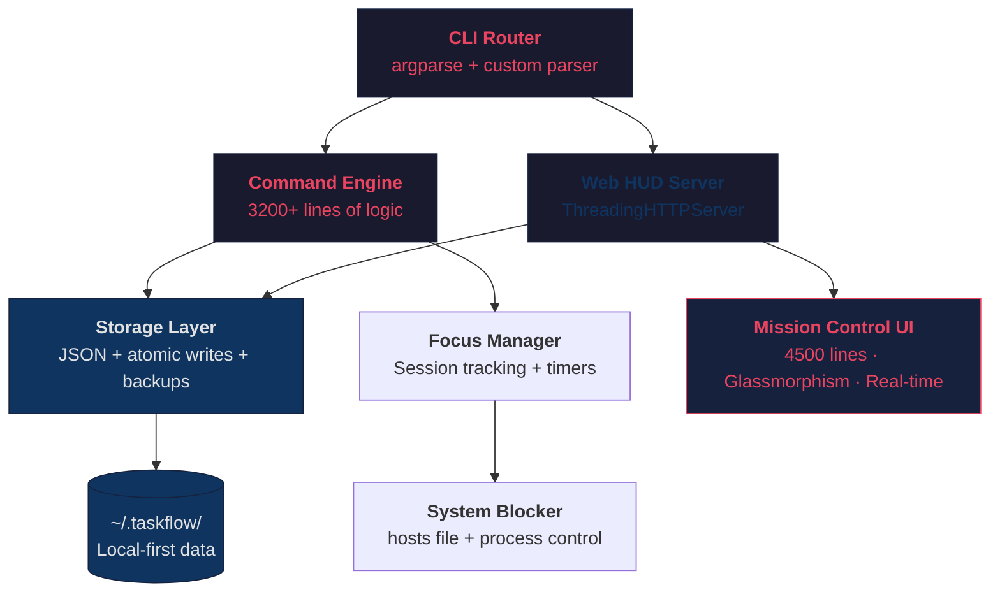

# 🧠 TaskFlow — The Psychology & Design Deep-Dive

<div align="center">
  <em>"The best productivity system is the one that works with your brain, not against it."</em>
</div>

---

> **This document is a companion to the [README](../README.md).** While the README shows you *what* TaskFlow does, this document explains *why* every feature exists — rooted in behavioral psychology, cognitive science, and battle-tested productivity frameworks used by elite performers.

---

## Table of Contents

- [The Core Problem](#-the-core-problem)
- [1. The Matrix — Eisenhower Prioritization](#-1-the-matrix--eisenhower-prioritization)
- [2. The One Frog Protocol — Parkinson's Law](#-2-the-one-frog-protocol--parkinsons-law)
- [3. Temporal Pressure — Urgency & The Deadline Effect](#-3-temporal-pressure--urgency--the-deadline-effect)
- [4. Focus Protocol — Flow State Engineering](#-4-focus-protocol--flow-state-engineering)
- [5. Frictionless Capture — The Zeigarnik Effect](#-5-frictionless-capture--the-zeigarnik-effect)
- [6. Dopamine & Momentum — Behavioral Persistence](#-6-dopamine--momentum--behavioral-persistence)
- [7. Recovery Mode — Cognitive Overload Defense](#-7-recovery-mode--cognitive-overload-defense)
- [8. Dual-Mode Reality Engine — Temporal Structuring](#-8-dual-mode-reality-engine--temporal-structuring)
- [Technical Architecture](#-technical-architecture)
- [References](#-references)

---

## 🎯 The Core Problem

Most productivity tools fail because they act as **passive databases** — digital dumping grounds for "things to do." This creates a paradox:

> *The more tasks you add, the more overwhelmed you feel. The more overwhelmed you feel, the less you execute. The less you execute, the more tasks pile up.*

This is the **Productivity Anxiety Loop**, and it's rooted in well-documented psychology:

- **Choice Paralysis** (Schwartz, 2004) — When presented with too many options, people freeze. A list of 47 tasks doesn't motivate; it paralyzes.
- **Cognitive Load Theory** (Sweller, 1988) — Working memory can hold ~4 items. Every unprocessed task in your list consumes cognitive bandwidth, even when you're not looking at it.
- **The Planning Fallacy** (Kahneman & Tversky, 1979) — People systematically underestimate task duration, leading to chronic over-planning and under-execution.

**TaskFlow's approach:** Instead of being a passive list, TaskFlow is an **Execution Engine** — it actively structures, constrains, and pressures your workflow to align with how your brain actually processes commitment and action.

---

## 🔥 1. The Matrix — Eisenhower Prioritization

### The Psychology

The human brain is naturally poor at differentiating between **Urgent** (requires immediate attention) and **Important** (contributes to long-term goals). When overwhelmed, the brain defaults to reacting to the Urgent while ignoring the Important. This is the **Mere Urgency Effect** (Zhu, Yang, & Hsee, 2018).

Additionally, the **Pareto Principle (80/20 Rule)** shows that roughly 80% of meaningful outcomes come from just 20% of your tasks. Most people spend their energy on the wrong 80%.

### Historical Precedent

**President Dwight D. Eisenhower** — Managing the Allied Forces in WWII and later the U.S. Presidency, Eisenhower organized his entire decision-making by separating the "Urgent" from the "Important":

> *"What is important is seldom urgent, and what is urgent is seldom important."*

### How TaskFlow Implements This

TaskFlow doesn't use numeric priorities (1-5). Instead, it uses **weight-class categorization** that maps directly to the Eisenhower Matrix:

| Priority | Matrix Zone | Behavioral Intent |
|:---|:---|:---|
| `[🔥 CRITICAL]` | Urgent + Important | **Do immediately.** No delay. |
| `[📅 STRATEGIC]` | Important + Not Urgent | The 20% that drives 80% of results. Must be scheduled. |
| `[⚡ NOISE]` | Urgent + Not Important | Delegate, automate, or bypass. |
| `[❌ PURGE]` | Not Urgent + Not Important | System actively suggests removal. |

By forcing categorization into behavioral zones rather than arbitrary numbers, TaskFlow eliminates the ambiguity that causes **priority inflation** — where everything becomes "high priority" and nothing gets done.

---

## 🐸 2. The One Frog Protocol — Parkinson's Law

### The Psychology

**Parkinson's Law** states: *"Work expands to fill the time allotted for its completion."* Give yourself "all day" to write a report, and it will take all day. Constrain yourself to 90 minutes, and you'll finish in 90 minutes.

Furthermore, research on **willpower depletion** (Baumeister & Tierney, 2011) shows that decision-making quality degrades throughout the day. Your strongest cognitive resources exist in the first 2-4 hours of your morning.

**Mark Twain** captured this perfectly:

> *"Eat a live frog first thing in the morning, and nothing worse will happen to you the rest of the day."*

### Historical Precedent

- **Elon Musk & Bill Gates** — Both are famous for strict "Time Boxing." Musk reportedly schedules his day in 5-minute increments. Every block is assigned a specific objective, eliminating the mental friction of choosing what to do next.
- **Cal Newport's Deep Work** — Newport argues that elite output requires eliminating choice from your morning routine. You don't "decide" what to work on; you commit to it the night before.

### How TaskFlow Implements This

The `[★ PRIME TARGET]` mechanic enforces **mathematical singularity**: exactly **one** primary objective per day. No exceptions.

```bash
taskflow prime 12          # Lock task #12 as today's Prime Target
taskflow today             # See your commitment
```

The system:
- Only allows **one** Prime Target per day
- Displays it with prominent visual hierarchy in both CLI and Web HUD
- Creates psychological commitment — once you "prime" a task, breaking that contract becomes psychologically costly (the **Commitment & Consistency Principle**, Cialdini, 1984)

Secondary tasks exist as supporting missions, but the Prime Target is your non-negotiable "frog."

---

## ⏱️ 3. Temporal Pressure — Urgency & The Deadline Effect

### The Psychology

**The Deadline Effect** is one of the most powerful productivity forces: tasks with clear deadlines are 2-3x more likely to be completed than open-ended ones. This is because:

- **Loss Aversion** (Kahneman & Tversky, 1979) — People fear losing progress more than they desire making progress. An approaching deadline triggers loss aversion.
- **The Arousal Theory of Motivation** — Moderate stress (eustress) improves performance. Too little → boredom. Too much → anxiety. A visible, approaching deadline creates optimal arousal.

### How TaskFlow Implements This

TaskFlow's **Temporal Pressure System** makes time *visible and visceral*:

- **Soft Deadlines** — Displayed in calm blue. Comfortable. No pressure. Just awareness.
- **Approaching Deadlines** — Shift to amber. Visual warmth increases. Your subconscious notices.
- **Hard Deadlines** — Pulsing red. CSS animations create urgency that bypasses rational thought and triggers your autonomic urgency response.
- **Overdue Tasks** — Don't just sit there passively. The system triggers the **Missed Deadline Confrontation**: you must explicitly choose to Execute, Postpone, Drop, or Offload. No ignoring allowed.

The **Postpone Mirror** adds social accountability to yourself: if you defer a task more than 3 times, a visible `postponed ×3 ⚠` badge appears — holding a mirror to your avoidance pattern and prompting a conscious decision.

---

## 🛡️ 4. Focus Protocol — Flow State Engineering

### The Psychology

The brain is a **sequential processor**; "multitasking" is a neuroscience myth. What people call multitasking is actually **rapid context-switching**, and research shows its cost is devastating:

- **Gloria Mark (UC Irvine)** — It takes an average of **23 minutes and 15 seconds** to regain deep focus after a single interruption.
- **The Pomodoro Technique** (Cirillo, 1980s) — Leverages the brain's natural **Ultradian rhythms** — 90-minute cycles of peak focus followed by rest. TaskFlow defaults to 25-minute bursts (or configurable up to 120 minutes) with mandatory breaks.
- **Flow State** (Csíkszentmihályi, 1990) — The optimal state of consciousness where performance peaks. Flow requires: clear goals, immediate feedback, and a challenge-to-skill ratio of ~4%. Interruptions instantly destroy flow.

### How TaskFlow Implements This

When you launch a focus session, TaskFlow creates a **multi-layered defense system**:

**Layer 1 — Visual Lockdown:**
The Web HUD background blurs via Glassmorphism. All non-essential UI elements fade to 25% opacity. Your chosen task becomes the only thing that exists visually.

**Layer 2 — Intentional Friction (Anti-Impulse Design):**
There is no "X" button to close the focus overlay. To break focus, you must:
1. Click a translucent red `ABORT PROTOCOL` button
2. Explicitly confirm a warning dialog

This **deliberate friction** exploits the **Hot-Cold Empathy Gap** (Loewenstein, 2005) — the small barrier between impulse and action is often enough to prevent you from quitting.

**Layer 3 — System-Level Defense (Optional):**
In `strict` mode, TaskFlow physically blocks distractions:
- Modifies the Windows `hosts` file to block specified websites
- Terminates unauthorized background applications

```bash
taskflow focus --id 7 --minutes 45 --mode strict --block-sites youtube.com,twitter.com
```

---

## 📥 5. Frictionless Capture — The Zeigarnik Effect

### The Psychology

The **Zeigarnik Effect** (1927) demonstrates that the brain remembers incomplete tasks better than completed ones. Every unwritten thought creates a "mental RAM leak" — consuming cognitive bandwidth and generating low-level anxiety even when you're focused on something else.

**David Allen's GTD** philosophy captures this perfectly:

> *"Your mind is for having ideas, not holding them."*

### How TaskFlow Implements This

The `dump` command is designed for **sub-3-second capture** — faster than opening any app:

```bash
taskflow dump "Call the dentist tomorrow 3pm #personal !h"
```

One command. No menus, no forms, no category selection. The NLP engine automatically extracts:
- **Priority** from `!h` (High), `!m` (Medium), `!l` (Low)
- **Tags** from `#personal`
- **Deadlines** from `tomorrow 3pm` (natural language parsing)

The **2-Second Rule**: if the thought can leave your head in under 2 seconds, you won't resist capturing it. If it takes 30 seconds of form-filling, you'll "remember it later" (you won't).

---

## 📈 6. Dopamine & Momentum — Behavioral Persistence

### The Psychology

Behavioral persistence is driven by **dopamine** — not as a "pleasure chemical" but as a **prediction-of-reward signal**. When progress is invisible, the brain stops predicting reward, and motivation dies.

Video games exploit this brilliantly:
- **Progress bars** create anticipation
- **Level-up animations** trigger dopamine release
- **Streak counters** create psychological fear of breaking the chain

**The Progress Principle** (Amabile & Kramer, 2011) — research across 12,000 diary entries showed that the #1 factor in workplace motivation is *making progress on meaningful work*. Not bonuses. Not praise. Just visible forward movement.

### How TaskFlow Implements This

- **The Completion Horizon**: A live, animated progress bar showing your daily completion rate. Watching it fill triggers the same reward pathway as a video game progress bar.
- **Completion Animations**: Marking a task as done triggers a premium visual overlay, not just a checkbox toggle. The feedback is *felt*, not just seen.
- **Intelligent Next Targets**: Completing a mission triggers a curated, 3-task deployment modal based on priority. This exploits the **Zeigarnik Effect in reverse** — by immediately presenting the next target, the brain's "what's next?" anxiety is pre-answered, locking you into continuous flow.
- **Postpone Mirrors**: Visible `postponed ×N` badges leverage **self-accountability** — you can't hide from your own patterns.

---

## 🚨 7. Recovery Mode — Cognitive Overload Defense

### The Psychology

When multiple deadlines collapse simultaneously, the brain enters **amygdala hijack** — the stress response overwhelms rational planning. In this state, people typically:
1. Freeze (do nothing)
2. Scatter (start 5 things, finish none)
3. Retreat (procrastinate on something easy)

None of these are productive. What's needed is **forced triage**.

### How TaskFlow Implements This

When the system detects too many missed deadlines in a single day, it triggers **Recovery Mode**:

- The UI darkens — non-essential tasks blur to 25% opacity
- A `RECOVERY MODE ACTIVE` gradient banner locks the interface
- You're presented with only 1-2 critical missions to salvage the day
- All secondary noise is visually eliminated

This is the digital equivalent of a **combat medic performing triage** — you can't save everything, so the system forces you to save what matters most.

---

## ⚡ 8. Dual-Mode Reality Engine — Temporal Structuring

### The Psychology

Most productivity systems treat all work as equal in temporal flexibility. This is a fundamental design error. Reality has two distinct temporal modes:

- **Flexible commitments** — "I need to finish the report this week" (execution discipline)
- **Fixed commitments** — "The meeting is at 2:00 PM Tuesday" (reality constraints)

Mixing these creates cognitive dissonance: your "task list" and your "calendar" fight for attention, and the brain can't cleanly separate what it *wants* to do from what it *has* to do.

### How TaskFlow Implements This

The **Dual-Mode Reality Engine** enforces a hard separation:

| Mode | Behavior | Temporal Properties |
|:---|:---|:---|
| **Task** | Flexible execution unit | Can be scheduled, postponed, re-prioritized |
| **Event** | Fixed reality constraint | Time-locked, duration auto-calculated, immutable once deployed |

**Visual Timeline Selection** makes scheduling tactile: drag across the timeline to block out `8:45 AM → 2:10 PM`. The engine instantly computes duration, sets strict deadlines, and deploys intelligent reminders.

For flexible tasks, the **NLP Parser** accepts natural language: `tomorrow 3pm`, `next friday`, `May 7`. No date format memorization required. A native calendar UI provides fallback for precision scheduling.

---

## 🏗️ Technical Architecture



### Design Principles

- **Local-first**: All data stored in `~/.taskflow/`. Zero cloud dependencies. Zero telemetry.
- **Atomic writes**: All saves go to a `.tmp` file first, then atomically replace the original. No data corruption on crash.
- **Auto-backup**: Last 10 states preserved automatically. One-command restore.
- **CLI-first, Web-enhanced**: Every feature works from the terminal. The Web HUD is a visual accelerator, not a dependency.

---

## 📚 References

| Concept | Source |
|:---|:---|
| Choice Paralysis | Schwartz, B. (2004). *The Paradox of Choice* |
| Cognitive Load Theory | Sweller, J. (1988). *Cognitive Load During Problem Solving* |
| Planning Fallacy | Kahneman, D. & Tversky, A. (1979) |
| Eisenhower Matrix | Eisenhower, D.D. — decision-making framework |
| Pareto Principle | Pareto, V. (1896). *Cours d'économie politique* |
| Parkinson's Law | Parkinson, C.N. (1955). *The Economist* |
| Willpower Depletion | Baumeister, R. & Tierney, J. (2011). *Willpower* |
| Deep Work | Newport, C. (2016). *Deep Work: Rules for Focused Success* |
| Commitment & Consistency | Cialdini, R. (1984). *Influence: The Psychology of Persuasion* |
| Context-Switching Cost | Mark, G. et al. (UC Irvine). *The Cost of Interrupted Work* |
| Pomodoro Technique | Cirillo, F. (1980s) |
| Flow State | Csíkszentmihályi, M. (1990). *Flow* |
| Hot-Cold Empathy Gap | Loewenstein, G. (2005) |
| Zeigarnik Effect | Zeigarnik, B. (1927) |
| GTD (Getting Things Done) | Allen, D. (2001). *Getting Things Done* |
| The Progress Principle | Amabile, T. & Kramer, S. (2011) |
| Mere Urgency Effect | Zhu, M., Yang, Y., & Hsee, C. (2018) |
| Dopamine & Motivation | Schultz, W. (1997). *Predictive Reward Signal of Dopamine Neurons* |

---

<div align="center">
  <strong>TaskFlow</strong> — Built by <a href="https://github.com/Mohith535">K Mohith Kannan</a>
  <br/>
  <em>Every feature is a hypothesis. Every release is an experiment. The lab is your terminal.</em>
</div>
